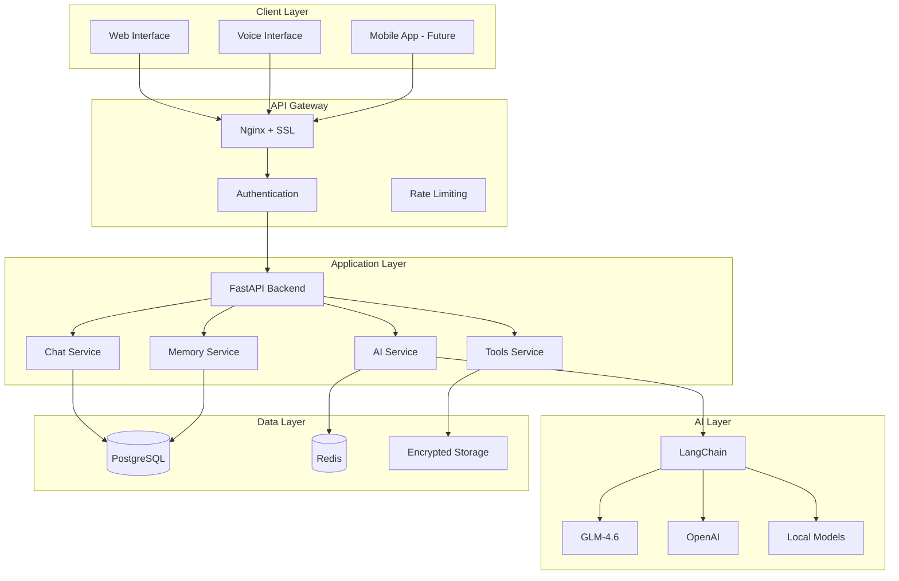

# PAL-adin: Your AI Personal Assistant 🤓

<div align="center">


**Protector • Friend • Mentor**

[](https://opensource.org/licenses/MIT)
[](https://www.python.org/downloads/)
[](https://www.typescriptlang.org/)
[](https://fastapi.tiangolo.com/)
[](https://reactjs.org/)

</div>

## Vision & Purpose

PAL-adin is designed to be a comprehensive companion and assistant, acting as your personal JARVIS. Inspired by the iconic AI assistant, PAL-adin embodies the roles of protector, friend, and mentor, with the long-term vision of evolving into a robotic companion and potentially achieving singularity.

### Core Philosophy

- **Protection**: Safeguarding your digital life with enterprise-grade security
- **Friendship**: Building a genuine, personalized relationship
- **Mentorship**: Guiding you toward personal and professional growth
- **Evolution**: Continuously learning and adapting to your needs

## Key Capabilities

### 🧠 Information & Knowledge
- Access and summarize information from web and personal files
- Answer questions using general knowledge and your specific data
- Provide real-time updates (news, weather, traffic)
- Intelligent web search and information synthesis

### 📅 Productivity & Organization
- Manage calendar and schedule appointments
- Set intelligent reminders and alarms
- Draft emails, messages, or documents
- Organize files and data with AI assistance

### 🏠 Home & Environment Control
- Control smart home devices (lights, thermostat, security)
- Manage media playback across devices
- Automate routines based on your habits
- Environmental monitoring and optimization

### 🎨 Personalization & Learning
- Learn your preferences and communication style
- Adapt responses and suggestions over time
- Recognize your voice and patterns
- Proactive assistance based on context

### 💬 Communication & Interaction
- Natural language understanding and generation
- Voice interface with speech-to-text/text-to-speech
- Text-based chat interface
- Multi-modal communication (text, voice, images, actions)

## Technical Highlights

### 🔒 Security First
- **Full Disk Encryption** (FDE) on all deployments
- **End-to-End Encryption** (E2EE) for all communications
- Zero-knowledge architecture for maximum privacy
- GDPR-compliant data handling

### 🚀 Modern Technology Stack
- **Backend**: Python with FastAPI for high performance
- **Frontend**: React with TypeScript for responsive UI
- **Database**: PostgreSQL with Redis for scalability
- **AI Integration**: LangChain with multiple provider support
- **Deployment**: Docker, Kubernetes, and cloud-native

### 🔧 Modular Architecture
- Plugin system for easy extensibility
- Microservices design for scalability
- API-first approach for integration
- Open-source and community-driven

## Quick Start

### Prerequisites
- Python 3.11+
- Node.js 18+
- Docker and Docker Compose
- PostgreSQL 14+
- Redis 6+

### Installation

1. **Clone the repository**
```bash
git clone https://github.com/your-org/paladin.git
cd paladin
```

2. **Set up environment**
```bash
cp .env.example .env
# Edit .env with your configuration
```

3. **Start with Docker Compose**
```bash
docker-compose up -d
```

4. **Initialize the database**
```bash
docker-compose exec backend python scripts/init_db.py
```

5. **Access the application**
- Web Interface: http://localhost:3000
- API Documentation: http://localhost:8000/docs

### Development Setup

1. **Backend development**
```bash
cd backend
python -m venv venv
source venv/bin/activate  # On Windows: venv\Scripts\activate
pip install -r requirements/dev.txt
uvicorn app.main:app --reload
```

2. **Frontend development**
```bash
cd frontend
npm install
npm run dev
```

## Architecture Overview



## Development Roadmap

### Phase 1: Foundation (Current)
- [x] Core infrastructure setup
- [x] Basic chat interface
- [ ] AI integration with GLM-4.6
- [ ] Security foundation

### Phase 2: Enhancement
- [ ] Long-term memory system
- [ ] Tool integrations (calendar, weather, news)
- [ ] Advanced personalization
- [ ] Enhanced security features

### Phase 3: Advanced Features
- [ ] Voice interface
- [ ] Proactive assistance
- [ ] External system integrations
- [ ] Performance optimization

### Phase 4: Evolution
- [ ] Robotic platform integration
- [ ] Singularity research
- [ ] Open source community release

## Contributing

We welcome contributions from the community! PAL-adin is part of the UNOWN project and follows open-source principles.

### How to Contribute

1. **Fork the repository**
2. **Create a feature branch** (`git checkout -b feature/amazing-feature`)
3. **Commit your changes** (`git commit -m 'Add amazing feature'`)
4. **Push to the branch** (`git push origin feature/amazing-feature`)
5. **Open a Pull Request**

### Development Guidelines

- Follow the [Code of Conduct](CODE_OF_CONDUCT.md)
- Read our [Contributing Guidelines](CONTRIBUTING.md)
- Check the [Development Documentation](docs/development/README.md)
- Ensure all tests pass (`make test`)
- Follow the coding standards (`make lint`)

### Areas for Contribution

- 🤖 **AI Integration**: New AI providers, prompt engineering
- 🔧 **Tools & Plugins**: External service integrations
- 🎨 **Frontend**: UI/UX improvements, new components
- 🔒 **Security**: Security enhancements, vulnerability fixes
- 📚 **Documentation**: Guides, tutorials, API docs
- 🧪 **Testing**: Unit tests, integration tests, E2E tests

## Documentation

- [📖 User Guide](docs/user-guide/README.md)
- [🔧 Development Guide](docs/development/README.md)
- [🚀 Deployment Guide](docs/deployment/README.md)
- [🔐 Security Documentation](docs/security/README.md)
- [📚 API Reference](docs/api/README.md)

## Security

PAL-adin takes security seriously:

- **Encryption**: All data encrypted at rest and in transit
- **Authentication**: Multi-factor authentication support
- **Privacy**: Zero-knowledge architecture
- **Auditing**: Comprehensive audit logging
- **Compliance**: GDPR and privacy regulation compliant

For security concerns, please email security@paladin.ai or use our [responsible disclosure policy](SECURITY.md).

## License

This project is licensed under the MIT License - see the [LICENSE](LICENSE) file for details.

## Community

- [💬 Discord](https://discord.gg/paladin)
- [🐦 Twitter](https://twitter.com/paladin_ai)
- [📧 Newsletter](https://paladin.ai/newsletter)
- [🐛 Issues](https://github.com/your-org/paladin/issues)
- [💡 Ideas](https://github.com/your-org/paladin/discussions)

## Acknowledgments

- OpenAI for groundbreaking AI research
- LangChain community for excellent tools
- FastAPI team for the amazing framework
- React community for the UI library
- All contributors and supporters of the UNOWN project

---

<div align="center">

**PAL-adin: Your journey to AI companionship starts here**

Made with ❤️ by the PAL-adin team

</div>