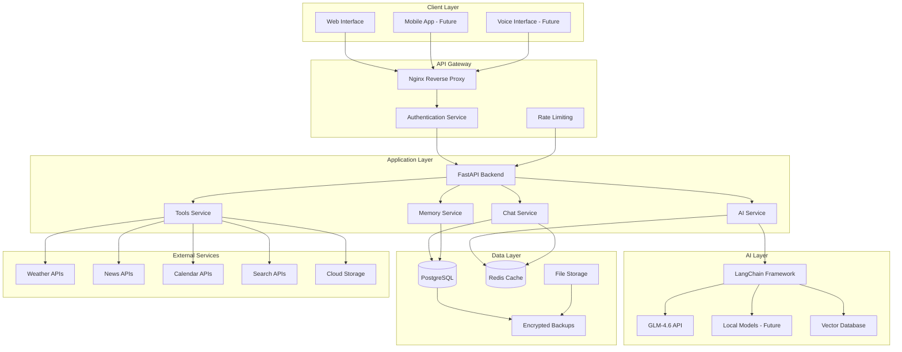
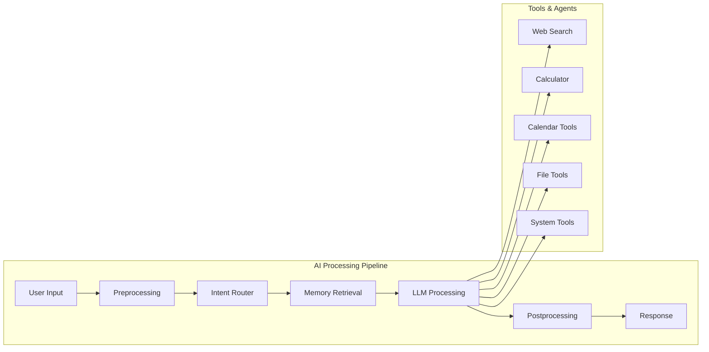
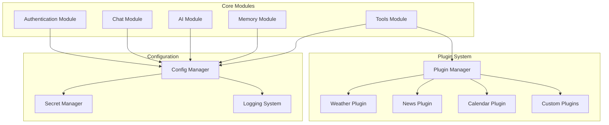

# PAL-adin System Architecture

## High-Level Architecture Overview



## Core Components

### 1. API Gateway & Security
- **Nginx**: Reverse proxy, SSL termination, load balancing
- **Authentication**: JWT-based auth with refresh tokens
- **Rate Limiting**: Prevent abuse and ensure fair usage
- **CORS**: Secure cross-origin resource sharing

### 2. Backend Services (FastAPI)

#### Chat Service
- Real-time WebSocket connections for chat
- Message routing and processing
- Conversation history management
- User session handling

#### AI Service
- LangChain integration for AI orchestration
- Multiple AI provider support (GLM-4.6, OpenAI, etc.)
- Prompt engineering and template management
- Response streaming and caching

#### Memory Service
- Long-term conversation memory
- User preference storage
- Context management
- Personalization data

#### Tools Service
- External API integrations
- Web search capabilities
- Calendar management
- File operations
- System commands (secure sandboxed)

### 3. AI Layer Architecture



### 4. Data Architecture

#### PostgreSQL Schema
```sql
-- Users and Authentication
users (id, username, email, encrypted_password, preferences, created_at)

-- Conversations
conversations (id, user_id, title, created_at, updated_at)

-- Messages
messages (id, conversation_id, role, content, metadata, timestamp)

-- User Memory & Preferences
user_memory (id, user_id, key, value, category, updated_at)

-- Tool Configurations
tool_configs (id, user_id, tool_name, config_data, encrypted)

-- External API Keys
api_keys (id, user_id, service_name, encrypted_key, created_at)
```

#### Redis Usage
- Session storage
- Conversation context caching
- Rate limiting counters
- Real-time message queues

### 5. Security Architecture

#### Encryption Layers
1. **Transport Layer**: TLS 1.3 for all communications
2. **Application Layer**: AES-256 for sensitive data
3. **Database Layer**: Transparent Data Encryption (TDE)
4. **File Storage**: Encrypted at rest and in transit

#### Access Control
- Role-based permissions (Admin, User, Guest)
- API key management
- Tool-specific permissions
- Audit logging

### 6. Modular Component Design



## Scalability Considerations

### Horizontal Scaling
- Stateless API design for easy scaling
- Redis cluster for distributed caching
- Database read replicas for query scaling
- Container orchestration with Kubernetes (future)

### Performance Optimization
- Response caching strategies
- Database query optimization
- CDN for static assets
- Lazy loading for AI models

### Monitoring & Observability
- Application metrics (Prometheus)
- Distributed tracing
- Error tracking and alerting
- Performance profiling

## Development Phases

### Phase 1: Core Functionality
- Basic chat interface
- GLM-4.6 integration
- User authentication
- Simple memory system

### Phase 2: Enhanced Features
- Tool integrations
- Advanced memory management
- Personalization
- Security hardening

### Phase 3: Advanced Capabilities
- Voice interface
- Proactive assistance
- Complex task automation
- External system integrations

This architecture provides a solid foundation for PAL-adin's evolution from a basic AI assistant to a comprehensive personal companion system.