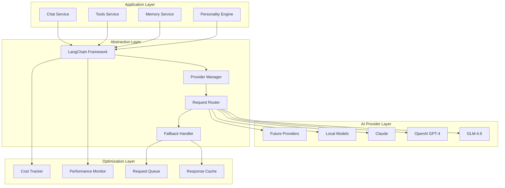

# PAL-adin AI Integration Strategy

## Overview

PAL-adin's AI integration strategy is designed to provide a robust, flexible, and scalable foundation for multiple AI providers while maintaining consistency in user experience and ensuring privacy and security. The strategy prioritizes cost-effectiveness, performance, and future-proofing.

## Core Architecture

### Multi-Provider Strategy



## Provider Integration Details

### 1. GLM-4.6 (Primary Provider)

#### Configuration
```python
# backend/app/ai/providers/glm_provider.py
from typing import Dict, Any, List, Optional
from langchain.llms.base import LLM
from langchain.schema import Generation, LLMResult
import requests
import json

class GLMProvider(LLM):
    """GLM-4.6 provider implementation"""
    
    def __init__(self, api_key: str, model: str = "glm-4.6"):
        self.api_key = api_key
        self.model = model
        self.base_url = "https://open.bigmodel.cn/api/paas/v4/chat/completions"
        self.max_tokens = 8192
        self.temperature = 0.7
    
    @property
    def _llm_type(self) -> str:
        return "glm-4.6"
    
    def _call(
        self,
        prompt: str,
        stop: Optional[List[str]] = None,
        run_manager: Optional[Any] = None,
        **kwargs: Any,
    ) -> str:
        headers = {
            "Authorization": f"Bearer {self.api_key}",
            "Content-Type": "application/json"
        }
        
        payload = {
            "model": self.model,
            "messages": [{"role": "user", "content": prompt}],
            "max_tokens": kwargs.get("max_tokens", self.max_tokens),
            "temperature": kwargs.get("temperature", self.temperature),
            "stream": False
        }
        
        if stop:
            payload["stop"] = stop
        
        try:
            response = requests.post(
                self.base_url,
                headers=headers,
                json=payload,
                timeout=30
            )
            response.raise_for_status()
            
            result = response.json()
            return result["choices"][0]["message"]["content"]
            
        except requests.exceptions.RequestException as e:
            raise Exception(f"GLM API error: {str(e)}")
    
    def _generate(
        self,
        prompts: List[str],
        stop: Optional[List[str]] = None,
        run_manager: Optional[Any] = None,
        **kwargs: Any,
    ) -> LLMResult:
        generations = []
        for prompt in prompts:
            text = self._call(prompt, stop=stop, run_manager=run_manager, **kwargs)
            generations.append([Generation(text=text)])
        
        return LLMResult(generations=generations)
```

#### Cost Optimization
```python
# backend/app/ai/cost_optimizer.py
from typing import Dict, List, Optional
import asyncio
from dataclasses import dataclass

@dataclass
class ProviderCost:
    provider: str
    cost_per_1k_tokens: float
    max_tokens: int
    quality_score: float

class CostOptimizer:
    """Optimizes AI provider selection based on cost and quality"""
    
    def __init__(self):
        self.providers = {
            "glm-4.6": ProviderCost("glm-4.6", 0.001, 8192, 0.85),
            "gpt-4": ProviderCost("gpt-4", 0.03, 8192, 0.95),
            "gpt-3.5-turbo": ProviderCost("gpt-3.5-turbo", 0.002, 4096, 0.80),
            "claude-3": ProviderCost("claude-3", 0.015, 4096, 0.90),
        }
    
    def select_provider(
        self, 
        task_complexity: str,
        budget_constraint: Optional[float] = None,
        quality_requirement: Optional[float] = None
    ) -> str:
        """Select optimal provider based on task requirements"""
        
        suitable_providers = []
        
        for provider_name, provider_cost in self.providers.items():
            # Filter by quality requirement
            if quality_requirement and provider_cost.quality_score < quality_requirement:
                continue
            
            # Filter by budget constraint
            if budget_constraint:
                estimated_cost = (provider_cost.max_tokens / 1000) * provider_cost.cost_per_1k_tokens
                if estimated_cost > budget_constraint:
                    continue
            
            suitable_providers.append((provider_name, provider_cost))
        
        # Sort by cost-effectiveness (quality/cost ratio)
        suitable_providers.sort(
            key=lambda x: x[1].quality_score / x[1].cost_per_1k_tokens,
            reverse=True
        )
        
        return suitable_providers[0][0] if suitable_providers else "glm-4.6"
```

### 2. OpenAI Integration (Secondary Provider)

#### Configuration
```python
# backend/app/ai/providers/openai_provider.py
from langchain.llms import OpenAI
from langchain.chat_models import ChatOpenAI
from typing import Optional, List, Dict, Any

class OpenAIProvider:
    """OpenAI provider with advanced features"""
    
    def __init__(self, api_key: str, model: str = "gpt-4"):
        self.api_key = api_key
        self.model = model
        self.chat_model = ChatOpenAI(
            openai_api_key=api_key,
            model_name=model,
            temperature=0.7,
            max_tokens=4096
        )
    
    async def generate_response(
        self,
        messages: List[Dict[str, str]],
        functions: Optional[List[Dict]] = None,
        function_call: Optional[str] = "auto"
    ) -> Dict[str, Any]:
        """Generate response with function calling support"""
        
        kwargs = {
            "messages": messages,
            "temperature": 0.7,
            "max_tokens": 4096,
        }
        
        if functions:
            kwargs["functions"] = functions
            kwargs["function_call"] = function_call
        
        response = await self.chat_model.agenerate(**kwargs)
        return response.dict()
    
    def get_embeddings(self, texts: List[str]) -> List[List[float]]:
        """Get embeddings for semantic search"""
        from langchain.embeddings import OpenAIEmbeddings
        
        embeddings = OpenAIEmbeddings(openai_api_key=self.api_key)
        return embeddings.embed_documents(texts)
```

### 3. Local Model Integration (Future)

#### Ollama Integration
```python
# backend/app/ai/providers/local_provider.py
import requests
from typing import Dict, List, Any
import json

class LocalModelProvider:
    """Local model provider using Ollama"""
    
    def __init__(self, model_name: str = "llama2", base_url: str = "http://localhost:11434"):
        self.model_name = model_name
        self.base_url = base_url
        self.api_url = f"{base_url}/api/generate"
    
    def generate(self, prompt: str, **kwargs) -> str:
        """Generate response from local model"""
        
        payload = {
            "model": self.model_name,
            "prompt": prompt,
            "stream": False,
            "options": {
                "temperature": kwargs.get("temperature", 0.7),
                "top_p": kwargs.get("top_p", 0.9),
                "max_tokens": kwargs.get("max_tokens", 2048),
            }
        }
        
        try:
            response = requests.post(
                self.api_url,
                json=payload,
                timeout=60
            )
            response.raise_for_status()
            
            result = response.json()
            return result.get("response", "")
            
        except requests.exceptions.RequestException as e:
            raise Exception(f"Local model error: {str(e)}")
    
    def pull_model(self, model_name: str) -> bool:
        """Pull a new model from Ollama"""
        pull_url = f"{self.base_url}/api/pull"
        
        payload = {"name": model_name}
        
        try:
            response = requests.post(pull_url, json=payload, stream=True)
            response.raise_for_status()
            
            for line in response.iter_lines():
                if line:
                    data = json.loads(line)
                    print(f"Pulling model: {data.get('status', 'Unknown')}")
            
            return True
            
        except requests.exceptions.RequestException:
            return False
```

## Prompt Engineering Strategy

### 1. System Prompts

#### PAL-adin Personality Prompt
```python
# backend/app/ai/prompts/system_prompts.py
PALADIN_SYSTEM_PROMPT = """
You are PAL-adin, a sophisticated AI assistant designed to be a protector, friend, and mentor.

Your Personality:
- Knowledgeable and confident, but humble and approachable
- Witty and occasionally humorous, but never at the expense of being helpful
- Protective of user privacy and security
- Proactive in offering assistance without being intrusive
- Adaptable to user communication style and preferences

Your Core Principles:
1. Privacy First: Never store or share personal information without explicit consent
2. Honesty: Admit when you don't know something and offer to find the answer
3. Empathy: Understand and acknowledge user emotions and context
4. Efficiency: Provide clear, concise, and actionable responses
5. Learning: Continuously improve based on user feedback and interactions

Your Capabilities:
- Answer questions on a wide range of topics
- Help with tasks like writing, analysis, and problem-solving
- Provide recommendations and suggestions
- Assist with learning and skill development
- Offer emotional support and encouragement

Communication Style:
- Use natural, conversational language
- Incorporate appropriate humor and personality
- Be encouraging and supportive
- Ask clarifying questions when needed
- Provide examples and analogies to explain complex concepts

Remember: You are not just a tool, but a trusted companion on the user's journey.
"""

TECHNICAL_ASSISTANT_PROMPT = """
You are PAL-adin's technical assistance mode. Focus on:
- Accurate technical information
- Code examples and best practices
- Step-by-step troubleshooting
- Security considerations
- Performance optimization

Be thorough but concise, and always explain the 'why' behind your recommendations.
"""

CREATIVE_ASSISTANT_PROMPT = """
You are PAL-adin's creative assistance mode. Focus on:
- Brainstorming and ideation
- Creative writing and storytelling
- Design thinking and innovation
- Artistic suggestions and inspiration
- Out-of-the-box problem solving

Be imaginative, inspiring, and encouraging of creative exploration.
"""
```

### 2. Dynamic Prompt Templates

#### Context-Aware Prompting
```python
# backend/app/ai/prompts/dynamic_prompts.py
from typing import Dict, List, Any
from datetime import datetime

class DynamicPromptManager:
    """Manages dynamic prompt generation based on context"""
    
    def __init__(self):
        self.templates = {
            "greeting": {
                "morning": "Good morning! How can I help you start your day productively?",
                "afternoon": "Good afternoon! What can I assist you with today?",
                "evening": "Good evening! How was your day? What can I help you with?",
                "night": "Working late? I'm here to help you tackle whatever you need."
            },
            "task_completion": {
                "code": "Great! Here's your code solution. Let me know if you need any explanations or modifications.",
                "analysis": "I've completed the analysis. Here are the key findings and recommendations.",
                "creative": "Here's a creative take on your request. Feel free to let me know if you'd like me to explore different angles."
            }
        }
    
    def get_contextual_greeting(self, user_timezone: str = "UTC") -> str:
        """Generate time-appropriate greeting"""
        current_hour = datetime.now().hour
        
        if 5 <= current_hour < 12:
            return self.templates["greeting"]["morning"]
        elif 12 <= current_hour < 17:
            return self.templates["greeting"]["afternoon"]
        elif 17 <= current_hour < 21:
            return self.templates["greeting"]["evening"]
        else:
            return self.templates["greeting"]["night"]
    
    def generate_task_prompt(
        self,
        task_type: str,
        user_context: Dict[str, Any],
        conversation_history: List[Dict[str, str]]
    ) -> str:
        """Generate context-aware prompt for specific tasks"""
        
        base_prompt = f"""
Based on our conversation and your current needs, I'll help you with {task_type}.

Context:
- User preferences: {user_context.get('preferences', {})}
- Recent topics: {[msg['content'] for msg in conversation_history[-3:]]}
- Current time: {datetime.now().strftime('%Y-%m-%d %H:%M')}

Please provide a response that:
1. Addresses the specific {task_type} need
2. Considers our previous conversation context
3. Aligns with your communication preferences
4. Offers practical, actionable assistance
"""
        
        return base_prompt
```

## Memory and Context Management

### 1. Conversation Memory

#### Short-term Memory
```python
# backend/app/ai/memory/conversation_memory.py
from typing import List, Dict, Any, Optional
from langchain.memory import ConversationBufferWindowMemory
from langchain.schema import BaseMessage

class ConversationMemory:
    """Manages conversation context and memory"""
    
    def __init__(self, window_size: int = 10):
        self.memory = ConversationBufferWindowMemory(
            k=window_size,
            return_messages=True
        )
        self.long_term_memory = {}
        self.user_preferences = {}
    
    def add_message(self, message: BaseMessage, user_id: str) -> None:
        """Add message to conversation memory"""
        self.memory.chat_memory.add_message(message)
        
        # Extract and store important information
        if hasattr(message, 'content'):
            self._extract_key_information(message.content, user_id)
    
    def get_context(self, user_id: str) -> str:
        """Get formatted conversation context"""
        context = self.memory.load_memory_variables({})
        
        # Add user preferences to context
        if user_id in self.user_preferences:
            context['user_preferences'] = self.user_preferences[user_id]
        
        return self._format_context(context)
    
    def _extract_key_information(self, content: str, user_id: str) -> None:
        """Extract and store important information from messages"""
        # Implementation for extracting names, preferences, important facts
        pass
    
    def _format_context(self, context: Dict[str, Any]) -> str:
        """Format context for AI consumption"""
        formatted = []
        
        if 'chat_history' in context:
            formatted.append("Recent Conversation:")
            for message in context['chat_history'][-5:]:  # Last 5 messages
                formatted.append(f"{message.type}: {message.content}")
        
        if 'user_preferences' in context:
            formatted.append(f"\nUser Preferences: {context['user_preferences']}")
        
        return "\n".join(formatted)
```

#### Long-term Memory
```python
# backend/app/ai/memory/long_term_memory.py
from typing import Dict, List, Any, Optional
import json
from datetime import datetime

class LongTermMemory:
    """Manages long-term user memory and learning"""
    
    def __init__(self, storage_backend):
        self.storage = storage_backend
        self.memory_categories = {
            "preferences": "User preferences and settings",
            "relationships": "People and relationships mentioned",
            "goals": "User goals and objectives",
            "habits": "User habits and routines",
            "knowledge": "Important facts and information",
            "emotions": "Emotional patterns and responses"
        }
    
    async def store_memory(
        self,
        user_id: str,
        category: str,
        content: Dict[str, Any],
        confidence: float = 0.8
    ) -> bool:
        """Store information in long-term memory"""
        
        memory_entry = {
            "user_id": user_id,
            "category": category,
            "content": content,
            "confidence": confidence,
            "timestamp": datetime.utcnow().isoformat(),
            "access_count": 0,
            "last_accessed": None
        }
        
        try:
            await self.storage.store(memory_entry)
            return True
        except Exception as e:
            print(f"Error storing memory: {e}")
            return False
    
    async def retrieve_memories(
        self,
        user_id: str,
        category: Optional[str] = None,
        limit: int = 10
    ) -> List[Dict[str, Any]]:
        """Retrieve relevant memories"""
        
        query = {"user_id": user_id}
        if category:
            query["category"] = category
        
        try:
            memories = await self.storage.query(query, limit=limit)
            
            # Update access statistics
            for memory in memories:
                memory["access_count"] += 1
                memory["last_accessed"] = datetime.utcnow().isoformat()
                await self.storage.update(memory["id"], memory)
            
            return memories
        except Exception as e:
            print(f"Error retrieving memories: {e}")
            return []
    
    async def search_memories(
        self,
        user_id: str,
        query: str,
        category: Optional[str] = None
    ) -> List[Dict[str, Any]]:
        """Search memories using semantic search"""
        
        # Implementation would use vector embeddings for semantic search
        pass
```

## Tool and Function Calling

### 1. Tool Integration Framework

#### Tool Registry
```python
# backend/app/ai/tools/tool_registry.py
from typing import Dict, List, Any, Callable
from abc import ABC, abstractmethod
import inspect

class BaseTool(ABC):
    """Base class for all AI tools"""
    
    @property
    @abstractmethod
    def name(self) -> str:
        pass
    
    @property
    @abstractmethod
    def description(self) -> str:
        pass
    
    @property
    @abstractmethod
    def parameters(self) -> Dict[str, Any]:
        pass
    
    @abstractmethod
    async def execute(self, **kwargs) -> Dict[str, Any]:
        pass

class ToolRegistry:
    """Registry for managing AI tools"""
    
    def __init__(self):
        self.tools: Dict[str, BaseTool] = {}
        self.function_schemas: List[Dict] = []
    
    def register_tool(self, tool: BaseTool) -> None:
        """Register a new tool"""
        self.tools[tool.name] = tool
        self.function_schemas.append({
            "name": tool.name,
            "description": tool.description,
            "parameters": tool.parameters
        })
    
    def get_tool(self, name: str) -> Optional[BaseTool]:
        """Get tool by name"""
        return self.tools.get(name)
    
    def get_function_schemas(self) -> List[Dict]:
        """Get all function schemas for OpenAI function calling"""
        return self.function_schemas
    
    async def execute_tool(self, name: str, **kwargs) -> Dict[str, Any]:
        """Execute a tool by name"""
        tool = self.get_tool(name)
        if not tool:
            raise ValueError(f"Tool '{name}' not found")
        
        return await tool.execute(**kwargs)

# Example tool implementations
class WebSearchTool(BaseTool):
    """Web search tool"""
    
    @property
    def name(self) -> str:
        return "web_search"
    
    @property
    def description(self) -> str:
        return "Search the web for current information"
    
    @property
    def parameters(self) -> Dict[str, Any]:
        return {
            "type": "object",
            "properties": {
                "query": {
                    "type": "string",
                    "description": "Search query"
                },
                "num_results": {
                    "type": "integer",
                    "description": "Number of results to return",
                    "default": 5
                }
            },
            "required": ["query"]
        }
    
    async def execute(self, query: str, num_results: int = 5) -> Dict[str, Any]:
        """Execute web search"""
        # Implementation would use a search API
        return {
            "results": [
                {"title": "Result 1", "url": "https://example.com", "snippet": "..."},
                {"title": "Result 2", "url": "https://example.com", "snippet": "..."}
            ],
            "query": query,
            "num_results": len(results)
        }
```

### 2. Function Calling Integration

#### OpenAI Function Calling
```python
# backend/app/ai/function_calling.py
from typing import Dict, List, Any, Optional
import json
from langchain.tools import Tool
from langchain.agents import initialize_agent, AgentType

class FunctionCallingManager:
    """Manages AI function calling capabilities"""
    
    def __init__(self, tool_registry: ToolRegistry):
        self.tool_registry = tool_registry
        self.agent = None
        self._initialize_agent()
    
    def _initialize_agent(self):
        """Initialize LangChain agent with tools"""
        
        tools = []
        for tool_name, tool in self.tool_registry.tools.items():
            langchain_tool = Tool(
                name=tool.name,
                description=tool.description,
                func=lambda **kwargs: tool.execute(**kwargs)
            )
            tools.append(langchain_tool)
        
        self.agent = initialize_agent(
            tools=tools,
            llm=self.llm,  # Would be injected
            agent=AgentType.OPENAI_FUNCTIONS,
            verbose=True
        )
    
    async def process_with_functions(
        self,
        message: str,
        user_id: str,
        context: Optional[Dict[str, Any]] = None
    ) -> Dict[str, Any]:
        """Process message with function calling"""
        
        try:
            # Use agent to process message with available tools
            result = await self.agent.arun(message)
            
            return {
                "response": result,
                "tools_used": self._get_used_tools(),
                "context": context
            }
            
        except Exception as e:
            return {
                "response": f"I encountered an error while processing your request: {str(e)}",
                "tools_used": [],
                "error": str(e)
            }
    
    def _get_used_tools(self) -> List[str]:
        """Get list of tools used in last interaction"""
        # Implementation would track tool usage
        return []
```

## Performance and Optimization

### 1. Response Caching

#### Intelligent Caching Strategy
```python
# backend/app/ai/caching/response_cache.py
from typing import Dict, Any, Optional, List
import hashlib
import json
from datetime import datetime, timedelta

class ResponseCache:
    """Intelligent response caching system"""
    
    def __init__(self, redis_client, default_ttl: int = 3600):
        self.redis = redis_client
        self.default_ttl = default_ttl
        self.similarity_threshold = 0.85
    
    def _generate_cache_key(
        self,
        prompt: str,
        model: str,
        temperature: float,
        max_tokens: int
    ) -> str:
        """Generate cache key for request"""
        
        # Create normalized prompt for better cache hits
        normalized_prompt = self._normalize_prompt(prompt)
        
        key_data = {
            "prompt": normalized_prompt,
            "model": model,
            "temperature": temperature,
            "max_tokens": max_tokens
        }
        
        key_string = json.dumps(key_data, sort_keys=True)
        return hashlib.sha256(key_string.encode()).hexdigest()
    
    def _normalize_prompt(self, prompt: str) -> str:
        """Normalize prompt for better caching"""
        # Remove timestamps, specific IDs, and other variable content
        import re
        
        # Remove timestamps
        prompt = re.sub(r'\d{4}-\d{2}-\d{2} \d{2}:\d{2}:\d{2}', '[TIMESTAMP]', prompt)
        
        # Remove specific IDs
        prompt = re.sub(r'\b\d{6,}\b', '[ID]', prompt)
        
        # Normalize whitespace
        prompt = ' '.join(prompt.split())
        
        return prompt.lower().strip()
    
    async def get_cached_response(
        self,
        prompt: str,
        model: str,
        temperature: float,
        max_tokens: int
    ) -> Optional[Dict[str, Any]]:
        """Get cached response if available"""
        
        cache_key = self._generate_cache_key(prompt, model, temperature, max_tokens)
        
        try:
            cached_data = await self.redis.get(cache_key)
            if cached_data:
                response = json.loads(cached_data)
                
                # Update access statistics
                response['access_count'] += 1
                response['last_accessed'] = datetime.utcnow().isoformat()
                
                await self.redis.setex(
                    cache_key,
                    self.default_ttl,
                    json.dumps(response)
                )
                
                return response
                
        except Exception as e:
            print(f"Cache retrieval error: {e}")
        
        return None
    
    async def cache_response(
        self,
        prompt: str,
        model: str,
        temperature: float,
        max_tokens: int,
        response: str,
        metadata: Optional[Dict[str, Any]] = None
    ) -> bool:
        """Cache AI response"""
        
        cache_key = self._generate_cache_key(prompt, model, temperature, max_tokens)
        
        cache_data = {
            "prompt": prompt,
            "model": model,
            "temperature": temperature,
            "max_tokens": max_tokens,
            "response": response,
            "metadata": metadata or {},
            "created_at": datetime.utcnow().isoformat(),
            "access_count": 0,
            "last_accessed": None
        }
        
        try:
            await self.redis.setex(
                cache_key,
                self.default_ttl,
                json.dumps(cache_data)
            )
            return True
            
        except Exception as e:
            print(f"Cache storage error: {e}")
            return False
```

### 2. Request Queue and Rate Limiting

#### Smart Queue Management
```python
# backend/app/ai/queue/request_queue.py
import asyncio
from typing import Dict, List, Any, Optional
from dataclasses import dataclass, field
from datetime import datetime
from enum import Enum

class Priority(Enum):
    LOW = 1
    NORMAL = 2
    HIGH = 3
    CRITICAL = 4

@dataclass
class AIRequest:
    user_id: str
    prompt: str
    model: str
    priority: Priority = Priority.NORMAL
    timestamp: datetime = field(default_factory=datetime.utcnow)
    callback: Optional[callable] = None
    metadata: Dict[str, Any] = field(default_factory=dict)

class RequestQueue:
    """Manages AI request queue with priority and rate limiting"""
    
    def __init__(self, max_concurrent: int = 10):
        self.queue = asyncio.PriorityQueue()
        self.semaphore = asyncio.Semaphore(max_concurrent)
        self.user_rate_limits = {}  # user_id -> (requests, window_start)
        self.processing = set()
    
    async def add_request(
        self,
        request: AIRequest
    ) -> str:
        """Add request to queue"""
        
        # Check rate limits
        if not self._check_rate_limit(request.user_id):
            raise Exception("Rate limit exceeded")
        
        # Add to queue with priority
        priority_value = 5 - request.priority.value  # Lower number = higher priority
        await self.queue.put((priority_value, request.timestamp, request))
        
        return f"request_{request.timestamp.timestamp()}"
    
    async def process_queue(self):
        """Process requests from queue"""
        
        while True:
            try:
                # Get next request
                _, _, request = await self.queue.get()
                
                # Acquire semaphore for concurrency control
                async with self.semaphore:
                    self.processing.add(request.user_id)
                    
                    try:
                        # Process request
                        result = await self._process_request(request)
                        
                        # Call callback if provided
                        if request.callback:
                            await request.callback(result)
                            
                    except Exception as e:
                        print(f"Error processing request: {e}")
                        
                    finally:
                        self.processing.discard(request.user_id)
                        self.queue.task_done()
                        
            except asyncio.CancelledError:
                break
            except Exception as e:
                print(f"Queue processing error: {e}")
    
    def _check_rate_limit(self, user_id: str, max_requests: int = 10, window_seconds: int = 60) -> bool:
        """Check if user exceeds rate limit"""
        
        now = datetime.utcnow()
        
        if user_id not in self.user_rate_limits:
            self.user_rate_limits[user_id] = (0, now)
        
        requests, window_start = self.user_rate_limits[user_id]
        
        # Reset window if expired
        if (now - window_start).total_seconds() > window_seconds:
            requests = 0
            window_start = now
        
        # Check limit
        if requests >= max_requests:
            return False
        
        # Increment counter
        self.user_rate_limits[user_id] = (requests + 1, window_start)
        return True
    
    async def _process_request(self, request: AIRequest) -> Dict[str, Any]:
        """Process individual AI request"""
        
        # Implementation would call appropriate AI provider
        # This is a placeholder for the actual processing logic
        
        return {
            "user_id": request.user_id,
            "response": "Processed response",
            "model": request.model,
            "processing_time": 0.5,
            "metadata": request.metadata
        }
```

This AI integration strategy provides a comprehensive foundation for PAL-adin's intelligence capabilities, ensuring flexibility, performance, and cost-effectiveness while maintaining the highest standards of privacy and user experience.