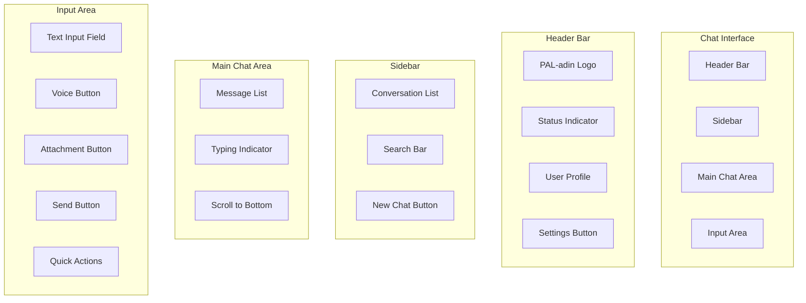

# PAL-adin Chat Interface Design

## Design Philosophy

The PAL-adin chat interface should embody the personality of a knowledgeable, friendly, and slightly witty companion - think JARVIS meets TARS with a touch of personal warmth. The design should be clean, intuitive, and adaptive to user preferences while maintaining a professional yet approachable aesthetic.

## User Experience Principles

### 1. Conversational Flow
- **Natural Interaction**: Mimics human conversation patterns
- **Context Awareness**: Maintains conversation context seamlessly
- **Progressive Disclosure**: Reveals complexity as needed
- **Anticipatory Design**: Predicts user needs and intentions

### 2. Personalization
- **Adaptive Interface**: Learns user preferences over time
- **Customizable Themes**: Multiple visual themes to suit user taste
- **Interaction Styles**: Adapts communication style to user
- **Smart Shortcuts**: Learns frequently used commands and topics

### 3. Accessibility
- **Keyboard Navigation**: Full keyboard accessibility
- **Screen Reader Support**: Comprehensive ARIA labels and descriptions
- **Visual Clarity**: High contrast options and scalable text
- **Voice Integration**: Voice input/output capabilities

## Visual Design System

### Color Palette

#### Primary Theme (Dark Mode)
```css
:root {
  /* Background Colors */
  --bg-primary: #0a0e1a;        /* Deep space blue */
  --bg-secondary: #141925;      /* Dark blue-gray */
  --bg-tertiary: #1e2433;       /* Medium blue-gray */
  
  /* Accent Colors */
  --accent-primary: #00d4ff;    /* Bright cyan - AI energy */
  --accent-secondary: #0099cc;  /* Medium cyan */
  --accent-success: #00ff88;    /* Green - success/confirmation */
  --accent-warning: #ff9500;    /* Orange - warnings */
  --accent-error: #ff3b30;      /* Red - errors */
  
  /* Text Colors */
  --text-primary: #ffffff;      /* White - main text */
  --text-secondary: #a0a8b8;    /* Light gray - secondary text */
  --text-muted: #6b7280;        /* Muted gray - hints */
  
  /* Border Colors */
  --border-light: #2a3441;      /* Light border */
  --border-medium: #3d4756;     /* Medium border */
  --border-dark: #1a2332;       /* Dark border */
}
```

#### Light Theme Alternative
```css
:root[data-theme="light"] {
  --bg-primary: #ffffff;
  --bg-secondary: #f8fafc;
  --bg-tertiary: #f1f5f9;
  
  --accent-primary: #0066cc;
  --accent-secondary: #0052a3;
  --accent-success: #00a854;
  --accent-warning: #ff8c00;
  --accent-error: #dc2626;
  
  --text-primary: #1a202c;
  --text-secondary: #4a5568;
  --text-muted: #718096;
  
  --border-light: #e2e8f0;
  --border-medium: #cbd5e0;
  --border-dark: #a0aec0;
}
```

### Typography

#### Font Hierarchy
```css
/* Font Family */
--font-primary: 'Inter', -apple-system, BlinkMacSystemFont, sans-serif;
--font-mono: 'JetBrains Mono', 'Fira Code', monospace;
--font-display: 'Space Grotesk', sans-serif;

/* Font Sizes */
--text-xs: 0.75rem;    /* 12px - metadata, timestamps */
--text-sm: 0.875rem;   /* 14px - secondary text */
--text-base: 1rem;     /* 16px - body text */
--text-lg: 1.125rem;   /* 18px - emphasized text */
--text-xl: 1.25rem;    /* 20px - small headings */
--text-2xl: 1.5rem;    /* 24px - section headings */
--text-3xl: 1.875rem;  /* 30px - main headings */

/* Font Weights */
--font-light: 300;
--font-normal: 400;
--font-medium: 500;
--font-semibold: 600;
--font-bold: 700;
```

### Spacing System
```css
--space-1: 0.25rem;   /* 4px */
--space-2: 0.5rem;    /* 8px */
--space-3: 0.75rem;   /* 12px */
--space-4: 1rem;      /* 16px */
--space-5: 1.25rem;   /* 20px */
--space-6: 1.5rem;    /* 24px */
--space-8: 2rem;      /* 32px */
--space-10: 2.5rem;   /* 40px */
--space-12: 3rem;     /* 48px */
--space-16: 4rem;     /* 64px */
```

## Component Design

### 1. Main Chat Interface

#### Layout Structure


#### Header Component
```typescript
interface HeaderProps {
  user: User;
  status: 'online' | 'away' | 'busy';
  onSettingsClick: () => void;
  onProfileClick: () => void;
}

const Header: React.FC<HeaderProps> = ({
  user,
  status,
  onSettingsClick,
  onProfileClick,
}) => {
  return (
    <header className="chat-header">
      <div className="header-left">
        <div className="logo">
          
          <span className="logo-text">PAL-adin</span>
        </div>
        <div className={`status-indicator status-${status}`}>
          <span className="status-dot"></span>
          <span className="status-text">{status}</span>
        </div>
      </div>
      
      <div className="header-right">
        <button 
          className="icon-button"
          onClick={onSettingsClick}
          aria-label="Settings"
        >
          <SettingsIcon />
        </button>
        <button 
          className="user-profile"
          onClick={onProfileClick}
          aria-label="User Profile"
        >
          
          <span className="user-name">{user.name}</span>
        </button>
      </div>
    </header>
  );
};
```

### 2. Message Components

#### Message Bubble Design
```typescript
interface MessageProps {
  message: Message;
  isTyping?: boolean;
  onReaction?: (emoji: string) => void;
  onCopy?: () => void;
  onShare?: () => void;
}

const MessageBubble: React.FC<MessageProps> = ({
  message,
  isTyping,
  onReaction,
  onCopy,
  onShare,
}) => {
  const isUser = message.role === 'user';
  const messageClass = `message ${isUser ? 'user-message' : 'ai-message'}`;
  
  return (
    <div className={messageClass}>
      <div className="message-content">
        {!isUser && (
          <div className="message-avatar">
            
          </div>
        )}
        
        <div className="message-bubble">
          <div className="message-text">
            {isTyping ? (
              <TypingIndicator />
            ) : (
              <ReactMarkdown>{message.content}</ReactMarkdown>
            )}
          </div>
          
          {message.metadata && (
            <div className="message-metadata">
              {message.metadata.thinking_time && (
                <span className="thinking-time">
                  🧔 {message.metadata.thinking_time}s
                </span>
              )}
              {message.metadata.confidence && (
                <span className="confidence">
                  🎯 {Math.round(message.metadata.confidence * 100)}%
                </span>
              )}
            </div>
          )}
          
          <div className="message-actions">
            <button 
              className="action-button"
              onClick={onCopy}
              aria-label="Copy message"
            >
              <CopyIcon />
            </button>
            <button 
              className="action-button"
              onClick={onShare}
              aria-label="Share message"
            >
              <ShareIcon />
            </button>
            <button 
              className="action-button"
              onClick={() => onReaction?.('👍')}
              aria-label="React with thumbs up"
            >
              👍
            </button>
          </div>
        </div>
      </div>
      
      <div className="message-timestamp">
        {formatTimestamp(message.timestamp)}
      </div>
    </div>
  );
};
```

#### Typing Indicator
```typescript
const TypingIndicator: React.FC = () => {
  return (
    <div className="typing-indicator">
      <div className="typing-dots">
        <span className="dot"></span>
        <span className="dot"></span>
        <span className="dot"></span>
      </div>
      <span className="typing-text">PAL-adin is thinking...</span>
    </div>
  );
};
```

### 3. Input Area Design

#### Smart Input Component
```typescript
interface InputAreaProps {
  onSendMessage: (message: string, attachments?: File[]) => void;
  onVoiceToggle: () => void;
  isRecording: boolean;
  suggestions?: string[];
  disabled?: boolean;
}

const InputArea: React.FC<InputAreaProps> = ({
  onSendMessage,
  onVoiceToggle,
  isRecording,
  suggestions = [],
  disabled = false,
}) => {
  const [input, setInput] = useState('');
  const [showSuggestions, setShowSuggestions] = useState(false);
  const textareaRef = useRef<HTMLTextAreaElement>(null);
  
  const handleSend = () => {
    if (input.trim() && !disabled) {
      onSendMessage(input.trim());
      setInput('');
      setShowSuggestions(false);
    }
  };
  
  const handleKeyDown = (e: React.KeyboardEvent) => {
    if (e.key === 'Enter' && !e.shiftKey) {
      e.preventDefault();
      handleSend();
    }
  };
  
  return (
    <div className="input-area">
      {showSuggestions && suggestions.length > 0 && (
        <div className="suggestions">
          {suggestions.map((suggestion, index) => (
            <button
              key={index}
              className="suggestion-item"
              onClick={() => setInput(suggestion)}
            >
              {suggestion}
            </button>
          ))}
        </div>
      )}
      
      <div className="input-container">
        <button 
          className="attachment-button"
          aria-label="Attach file"
          disabled={disabled}
        >
          <PaperclipIcon />
        </button>
        
        <textarea
          ref={textareaRef}
          value={input}
          onChange={(e) => setInput(e.target.value)}
          onKeyDown={handleKeyDown}
          placeholder="Type your message... (Shift+Enter for new line)"
          className="message-input"
          disabled={disabled}
          rows={1}
        />
        
        <button
          className={`voice-button ${isRecording ? 'recording' : ''}`}
          onClick={onVoiceToggle}
          aria-label={isRecording ? 'Stop recording' : 'Start voice input'}
          disabled={disabled}
        >
          {isRecording ? <StopIcon /> : <MicIcon />}
        </button>
        
        <button
          className="send-button"
          onClick={handleSend}
          disabled={!input.trim() || disabled}
          aria-label="Send message"
        >
          <SendIcon />
        </button>
      </div>
      
      <div className="quick-actions">
        <button className="quick-action" aria-label="Generate code">
          <CodeIcon /> Code
        </button>
        <button className="quick-action" aria-label="Analyze text">
          <AnalyzeIcon /> Analyze
        </button>
        <button className="quick-action" aria-label="Summarize">
          <SummarizeIcon /> Summarize
        </button>
        <button className="quick-action" aria-label="Translate">
          <TranslateIcon /> Translate
        </button>
      </div>
    </div>
  );
};
```

## Interaction Patterns

### 1. Conversation Management

#### Conversation List
```typescript
interface Conversation {
  id: string;
  title: string;
  lastMessage: string;
  timestamp: Date;
  unreadCount: number;
  pinned: boolean;
  archived: boolean;
}

const ConversationList: React.FC = () => {
  const [conversations, setConversations] = useState<Conversation[]>([]);
  const [searchQuery, setSearchQuery] = useState('');
  
  const filteredConversations = conversations.filter(conv =>
    conv.title.toLowerCase().includes(searchQuery.toLowerCase()) ||
    conv.lastMessage.toLowerCase().includes(searchQuery.toLowerCase())
  );
  
  return (
    <div className="conversation-list">
      <div className="conversation-header">
        <h2>Conversations</h2>
        <button className="new-chat-button" aria-label="New conversation">
          <PlusIcon />
        </button>
      </div>
      
      <div className="search-container">
        <input
          type="text"
          placeholder="Search conversations..."
          value={searchQuery}
          onChange={(e) => setSearchQuery(e.target.value)}
          className="search-input"
        />
      </div>
      
      <div className="conversations">
        {filteredConversations.map((conversation) => (
          <ConversationItem
            key={conversation.id}
            conversation={conversation}
            onSelect={() => selectConversation(conversation.id)}
            onPin={() => togglePin(conversation.id)}
            onDelete={() => deleteConversation(conversation.id)}
          />
        ))}
      </div>
    </div>
  );
};
```

### 2. Smart Features

#### Contextual Suggestions
```typescript
const useSmartSuggestions = (currentInput: string, conversationHistory: Message[]) => {
  const [suggestions, setSuggestions] = useState<string[]>([]);
  
  useEffect(() => {
    if (currentInput.length > 2) {
      // Generate contextual suggestions based on:
      // 1. Current input pattern
      // 2. Conversation history
      // 3. User preferences
      // 4. Common commands
      
      const generatedSuggestions = generateSuggestions(
        currentInput,
        conversationHistory,
        userPreferences
      );
      
      setSuggestions(generatedSuggestions);
    } else {
      setSuggestions([]);
    }
  }, [currentInput, conversationHistory]);
  
  return suggestions;
};
```

#### Voice Integration
```typescript
const VoiceInput: React.FC = () => {
  const [isListening, setIsListening] = useState(false);
  const [transcript, setTranscript] = useState('');
  
  const startListening = () => {
    const recognition = new (window.SpeechRecognition || window.webkitSpeechRecognition)();
    
    recognition.onresult = (event) => {
      const current = event.resultIndex;
      const transcript = event.results[current][0].transcript;
      setTranscript(transcript);
    };
    
    recognition.onerror = (event) => {
      console.error('Speech recognition error:', event.error);
      setIsListening(false);
    };
    
    recognition.onend = () => {
      setIsListening(false);
    };
    
    recognition.start();
    setIsListening(true);
  };
  
  return (
    <button
      className={`voice-button ${isListening ? 'listening' : ''}`}
      onClick={isListening ? stopListening : startListening}
      aria-label={isListening ? 'Stop listening' : 'Start voice input'}
    >
      {isListening ? <ListeningIcon /> : <MicIcon />}
    </button>
  );
};
```

## Responsive Design

### Mobile Adaptations
```css
/* Mobile Styles */
@media (max-width: 768px) {
  .chat-interface {
    flex-direction: column;
  }
  
  .sidebar {
    position: fixed;
    left: -100%;
    width: 80%;
    height: 100%;
    z-index: 1000;
    transition: left 0.3s ease;
  }
  
  .sidebar.open {
    left: 0;
  }
  
  .main-chat {
    width: 100%;
  }
  
  .input-area {
    padding: 1rem;
  }
  
  .quick-actions {
    display: none; /* Hide on mobile, use swipe gestures */
  }
}
```

### Tablet Adaptations
```css
/* Tablet Styles */
@media (min-width: 769px) and (max-width: 1024px) {
  .sidebar {
    width: 300px;
  }
  
  .main-chat {
    flex: 1;
  }
  
  .message-bubble {
    max-width: 85%;
  }
}
```

## Animation and Micro-interactions

### Message Animations
```css
@keyframes messageSlideIn {
  from {
    opacity: 0;
    transform: translateY(20px);
  }
  to {
    opacity: 1;
    transform: translateY(0);
  }
}

.message-bubble {
  animation: messageSlideIn 0.3s ease-out;
}

@keyframes typingPulse {
  0%, 100% {
    opacity: 0.3;
  }
  50% {
    opacity: 1;
  }
}

.typing-dots .dot {
  animation: typingPulse 1.4s infinite ease-in-out;
}

.typing-dots .dot:nth-child(2) {
  animation-delay: 0.2s;
}

.typing-dots .dot:nth-child(3) {
  animation-delay: 0.4s;
}
```

### Hover States and Transitions
```css
.message-bubble {
  transition: transform 0.2s ease, box-shadow 0.2s ease;
}

.message-bubble:hover {
  transform: translateY(-2px);
  box-shadow: 0 4px 12px rgba(0, 212, 255, 0.1);
}

.action-button {
  transition: all 0.2s ease;
}

.action-button:hover {
  background-color: var(--accent-primary);
  color: var(--bg-primary);
  transform: scale(1.1);
}
```

## Accessibility Features

### Keyboard Navigation
```typescript
const useKeyboardNavigation = () => {
  useEffect(() => {
    const handleKeyDown = (e: KeyboardEvent) => {
      // Ctrl/Cmd + K for search
      if ((e.ctrlKey || e.metaKey) && e.key === 'k') {
        e.preventDefault();
        focusSearchInput();
      }
      
      // Ctrl/Cmd + N for new chat
      if ((e.ctrlKey || e.metaKey) && e.key === 'n') {
        e.preventDefault();
        createNewChat();
      }
      
      // Escape to close modals/sidebars
      if (e.key === 'Escape') {
        closeModals();
      }
    };
    
    document.addEventListener('keydown', handleKeyDown);
    return () => document.removeEventListener('keydown', handleKeyDown);
  }, []);
};
```

### Screen Reader Support
```typescript
const MessageBubble: React.FC<MessageProps> = ({ message }) => {
  return (
    <div 
      className="message-bubble"
      role="article"
      aria-label={`Message from ${message.role}: ${message.content.substring(0, 50)}...`}
    >
      <div className="message-content" aria-live="polite">
        <ReactMarkdown>{message.content}</ReactMarkdown>
      </div>
      
      <div className="message-metadata" aria-label="Message metadata">
        <time dateTime={message.timestamp.toISOString()}>
          {formatTimestamp(message.timestamp)}
        </time>
        {message.metadata.confidence && (
          <span aria-label={`Confidence level: ${Math.round(message.metadata.confidence * 100)}%`}>
            🎯 {Math.round(message.metadata.confidence * 100)}%
          </span>
        )}
      </div>
    </div>
  );
};
```

This chat interface design provides a comprehensive foundation for creating an engaging, accessible, and personalized user experience that embodies the PAL-adin personality while maintaining high standards of usability and performance.