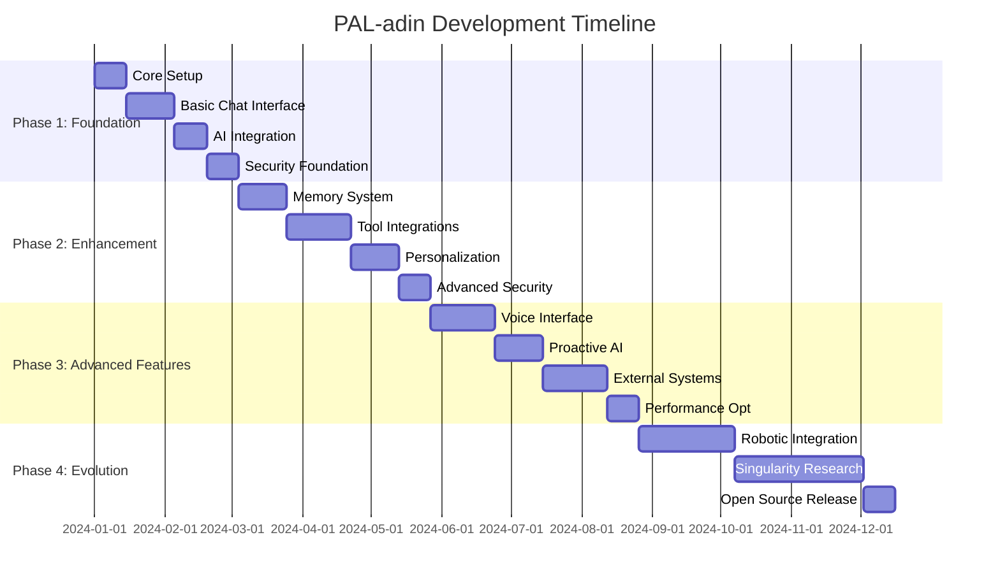

# PAL-adin Development Roadmap

## Project Timeline Overview

## Phase 1: Foundation (8-10 weeks)

### Sprint 1: Core Infrastructure (2 weeks)
**Objective**: Establish development environment and basic project structure

**Milestones**:
- [x] Technology stack selection and documentation
- [x] System architecture design
- [x] Security infrastructure planning
- [x] Project structure definition
- [ ] Repository setup with CI/CD pipeline
- [ ] Development environment configuration
- [ ] Database schema design and migration setup
- [ ] Basic authentication system

**Deliverables**:
- Functional development environment
- Git repository with proper branching strategy
- Basic FastAPI application structure
- PostgreSQL database with initial schema
- JWT authentication system
- Docker development setup

**Success Criteria**:
- Developers can run the application locally
- Basic API endpoints are accessible
- Database migrations work correctly
- Authentication flow is functional

### Sprint 2: Basic Chat Interface (3 weeks)
**Objective**: Implement core chat functionality with web interface

**Milestones**:
- [ ] React frontend setup with TypeScript
- [ ] WebSocket implementation for real-time chat
- [ ] Message storage and retrieval
- [ ] Basic conversation management
- [ ] Responsive UI design
- [ ] Error handling and validation
- [ ] Basic rate limiting

**Deliverables**:
- Functional chat interface
- Real-time message exchange
- Conversation history
- User-friendly error messages
- Mobile-responsive design

**Success Criteria**:
- Users can send and receive messages
- Chat history is preserved
- Interface works on desktop and mobile
- Basic error scenarios are handled gracefully

### Sprint 3: AI Integration (2 weeks)
**Objective**: Integrate GLM-4.6 and establish AI processing pipeline

**Milestones**:
- [ ] LangChain integration setup
- [ ] GLM-4.6 API integration
- [ ] Prompt template system
- [ ] Basic AI response processing
- [ ] Context management
- [ ] Error handling for AI failures
- [ ] Response caching

**Deliverables**:
- Working AI integration
- Prompt management system
- Context-aware responses
- Fallback mechanisms

**Success Criteria**:
- AI responds to user messages
- Context is maintained across conversations
- System handles API failures gracefully
- Response times are acceptable

### Sprint 4: Security Foundation (2 weeks)
**Objective**: Implement comprehensive security measures

**Milestones**:
- [ ] End-to-end encryption implementation
- [ ] Data encryption at rest
- [ ] Security headers and CORS
- [ ] Input validation and sanitization
- [ ] Audit logging system
- [ ] Security monitoring setup
- [ ] Penetration testing basics

**Deliverables**:
- Encrypted data storage
- Secure communication channels
- Security monitoring dashboard
- Security documentation

**Success Criteria**:
- All data is encrypted in transit and at rest
- Security vulnerabilities are identified and addressed
- Audit trail is comprehensive
- System passes basic security tests

## Phase 2: Enhancement (12 weeks)

### Sprint 5: Memory System (3 weeks)
**Objective**: Implement long-term memory and personalization

**Milestones**:
- [ ] Long-term conversation memory
- [ ] User preference storage
- [ ] Context retrieval system
- [ ] Memory compression and summarization
- [ ] Personalization algorithms
- [ ] Memory privacy controls

**Deliverables**:
- Persistent memory system
- User preference management
- Intelligent context retrieval
- Privacy controls for memory data

**Success Criteria**:
- PAL-adin remembers past conversations
- Responses are personalized based on user history
- Memory system is efficient and scalable
- Users have control over their memory data

### Sprint 6: Tool Integrations (4 weeks)
**Objective**: Integrate external tools and services

**Milestones**:
- [ ] Web search integration
- [ ] Calculator and computational tools
- [ ] Calendar integration (Google Calendar, etc.)
- [ ] Weather information
- [ ] News aggregation
- [ ] File operations
- [ ] Plugin system foundation

**Deliverables**:
- Functional tool ecosystem
- Plugin management system
- External API integrations
- Tool permission system

**Success Criteria**:
- PAL-adin can perform web searches
- Calendar operations work seamlessly
- Weather and news information is accurate
- Plugin system allows easy extension

### Sprint 7: Personalization (3 weeks)
**Objective**: Advanced personalization and learning

**Milestones**:
- [ ] Machine learning for user preferences
- [ ] Adaptive response styles
- [ ] Habit recognition
- [ ] Proactive suggestion system
- [ ] User behavior analysis
- [ ] Personalization dashboard

**Deliverables**:
- Adaptive AI personality
- Proactive assistance features
- User analytics dashboard
- Personalization controls

**Success Criteria**:
- PAL-adin adapts to user communication style
- Proactive suggestions are helpful
- Users can customize personalization level
- System learns from user feedback

### Sprint 8: Advanced Security (2 weeks)
**Objective**: Harden security and implement advanced features

**Milestones**:
- [ ] Multi-factor authentication
- [ ] Advanced threat detection
- [ ] Security automation
- [ ] Compliance features (GDPR)
- [ ] Security audit tools
- [ ] Incident response procedures

**Deliverables**:
- Enhanced authentication system
- Security monitoring and alerting
- Compliance documentation
- Security incident response plan

**Success Criteria**:
- Multi-factor authentication works reliably
- Security threats are detected quickly
- System complies with privacy regulations
- Security incidents are handled efficiently

## Phase 3: Advanced Features (13 weeks)

### Sprint 9: Voice Interface (4 weeks)
**Objective**: Implement voice interaction capabilities

**Milestones**:
- [ ] Speech-to-text integration
- [ ] Text-to-speech implementation
- [ ] Voice command recognition
- [ ] Audio processing pipeline
- [ ] Voice authentication
- [ ] Audio quality optimization

**Deliverables**:
- Functional voice interface
- Voice command system
- Audio processing pipeline
- Voice authentication

**Success Criteria**:
- Voice commands are accurately recognized
- Text-to-speech quality is natural
- Voice authentication is secure
- Audio processing is real-time

### Sprint 10: Proactive AI (3 weeks)
**Objective**: Implement proactive assistance capabilities

**Milestones**:
- [ ] Proactive notification system
- [ ] Predictive assistance
- [ ] Automated task execution
- [ ] Context-aware suggestions
- [ ] User intent prediction
- [ ] Proactive learning system

**Deliverables**:
- Proactive assistance engine
- Predictive analytics
- Automated task system
- Intent recognition system

**Success Criteria**:
- PAL-adin anticipates user needs
- Proactive suggestions are relevant
- Automated tasks are executed correctly
- System learns from user behavior

### Sprint 11: External Systems (4 weeks)
**Objective**: Deep integration with external systems

**Milestones**:
- [ ] Smart home device integration
- [ ] Email system integration
- [ ] Social media connections
- [ ] Cloud storage integration
- [ ] Third-party service APIs
- [ ] System automation workflows

**Deliverables**:
- Smart home control system
- Email management capabilities
- Social media integration
- Cloud storage connectivity

**Success Criteria**:
- Smart home devices are controllable
- Email management is seamless
- Social media integration works smoothly
- Cloud storage operations are reliable

### Sprint 12: Performance Optimization (2 weeks)
**Objective**: Optimize system performance and scalability

**Milestones**:
- [ ] Database query optimization
- [ ] Caching strategy implementation
- [ ] Load balancing setup
- [ ] Performance monitoring
- [ ] Resource usage optimization
- [ ] Scalability testing

**Deliverables**:
- Optimized database performance
- Efficient caching system
- Load balancing configuration
- Performance monitoring dashboard

**Success Criteria**:
- Response times are under 200ms
- System handles 1000+ concurrent users
- Resource usage is optimized
- Performance metrics are monitored

## Phase 4: Evolution (16+ weeks)

### Sprint 13: Robotic Integration (6 weeks)
**Objective**: Begin integration with robotic systems

**Milestones**:
- [ ] Robotic platform research
- [ ] Hardware interface design
- [ ] Motor control systems
- [ ] Sensor integration
- [ ] Basic movement capabilities
- [ ] Safety systems implementation

**Deliverables**:
- Robotic platform prototype
- Hardware interface layer
- Basic motor control
- Sensor integration system

**Success Criteria**:
- Robotic platform can move
- Sensors provide accurate data
- Safety systems prevent accidents
- Hardware integration is stable

### Sprint 14: Singularity Research (8 weeks)
**Objective**: Research and develop singularity concepts

**Milestones**:
- [ ] Consciousness simulation research
- [ ] Advanced AI algorithms
- [ ] Neural network architectures
- [ ] Cognitive modeling
- [ ] Ethical framework development
- [ ] Singularity safety protocols

**Deliverables**:
- Research papers on consciousness
- Advanced AI algorithms
- Cognitive models
- Ethical guidelines

**Success Criteria**:
- Research contributes to AI field
- Ethical frameworks are comprehensive
- Safety protocols are robust
- Concepts are theoretically sound

### Sprint 15: Open Source Release (2 weeks)
**Objective**: Prepare and release PAL-adin as open source

**Milestones**:
- [ ] Code documentation completion
- [ ] License selection and application
- [ ] Community guidelines creation
- [ ] Contribution guidelines
- [ ] Release preparation
- [ ] Community launch

**Deliverables**:
- Complete documentation
- Open source license
- Community guidelines
- Public release

**Success Criteria**:
- Code is well-documented
- Community guidelines are clear
- Release is successful
- Community engagement begins

## Success Metrics

### Technical Metrics
- **Response Time**: < 200ms for chat responses
- **Uptime**: > 99.9% availability
- **Security**: Zero critical vulnerabilities
- **Scalability**: Support 1000+ concurrent users

### User Experience Metrics
- **User Satisfaction**: > 4.5/5 rating
- **Task Completion**: > 90% success rate
- **Personalization**: Users feel PAL-adin "knows" them
- **Proactive Assistance**: > 80% of suggestions are helpful

### Development Metrics
- **Code Quality**: > 90% test coverage
- **Documentation**: 100% API documentation
- **Community**: Active contributor base
- **Innovation**: Regular feature releases

## Risk Mitigation

### Technical Risks
- **AI API Limitations**: Multiple provider strategy
- **Security Breaches**: Comprehensive security testing
- **Performance Issues**: Continuous monitoring and optimization
- **Scalability Problems**: Modular architecture design

### Project Risks
- **Scope Creep**: Clear milestone definitions
- **Resource Constraints**: Phased development approach
- **Timeline Delays**: Agile methodology with buffer time
- **Quality Issues**: Comprehensive testing strategy

This roadmap provides a clear path from basic AI assistant to the ambitious goal of creating a comprehensive personal companion system, with flexibility to adapt to new technologies and user feedback.