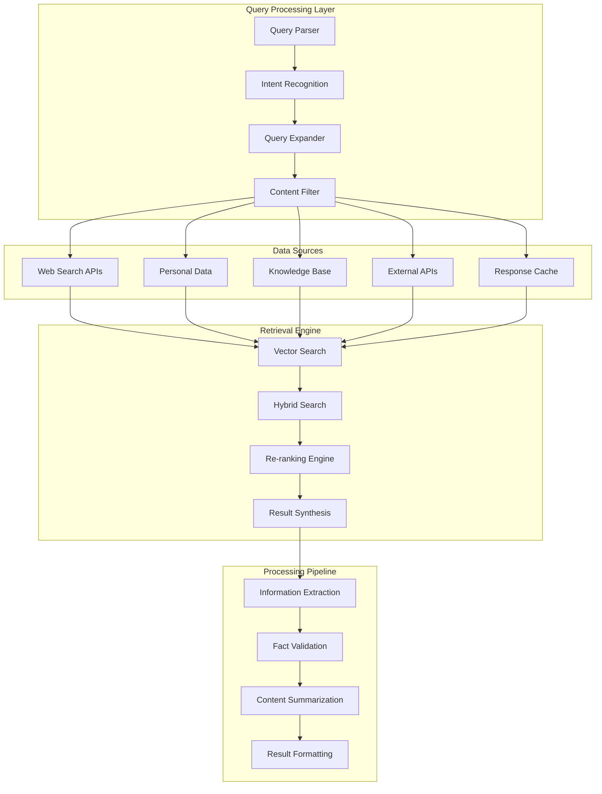

# PAL-adin Information Retrieval System

## Overview

PAL-adin's information retrieval system is designed to provide comprehensive, accurate, and contextually relevant information from multiple sources while maintaining user privacy and ensuring real-time data access. The system combines web search, personal data indexing, semantic search, and intelligent filtering to deliver the most relevant results for user queries.

## System Architecture



## Query Processing

### 1. Query Analysis and Intent Recognition

#### Query Parser
```python
# backend/app/retrieval/query_parser.py
from typing import Dict, List, Any, Optional
import re
from dataclasses import dataclass
from enum import Enum

class QueryType(Enum):
    FACTUAL = "factual"
    NAVIGATIONAL = "navigational"
    TRANSACTIONAL = "transactional"
    INFORMATIONAL = "informational"
    CONVERSATIONAL = "conversational"
    TEMPORAL = "temporal"
    LOCATION = "location"

@dataclass
class ParsedQuery:
    original: str
    cleaned: str
    query_type: QueryType
    entities: List[Dict[str, Any]]
    keywords: List[str]
    filters: Dict[str, Any]
    intent: str
    confidence: float

class QueryParser:
    """Advanced query parsing and intent recognition"""
    
    def __init__(self):
        self.patterns = {
            'question': re.compile(r'^(what|how|why|when|where|who|which|can|could|would|should|is|are|do|does)\b', re.IGNORECASE),
            'location': re.compile(r'\b(near|in|at|around|close to)\s+([A-Za-z\s]+)', re.IGNORECASE),
            'time': re.compile(r'\b(today|tomorrow|yesterday|last week|next month|this year|\d{4}-\d{2}-\d{2})\b', re.IGNORECASE),
            'price': re.compile(r'\b(under|over|between|around)\s+\$?\d+', re.IGNORECASE),
            'comparison': re.compile(r'\b(compare|vs|versus|difference between)\b', re.IGNORECASE),
        }
        
        self.stop_words = {'the', 'a', 'an', 'and', 'or', 'but', 'in', 'on', 'at', 'to', 'for', 'of', 'with', 'by'}
    
    def parse(self, query: str) -> ParsedQuery:
        """Parse and analyze user query"""
        
        # Clean query
        cleaned = self._clean_query(query)
        
        # Identify query type
        query_type = self._identify_query_type(cleaned)
        
        # Extract entities
        entities = self._extract_entities(cleaned)
        
        # Extract keywords
        keywords = self._extract_keywords(cleaned)
        
        # Extract filters
        filters = self._extract_filters(cleaned)
        
        # Determine intent
        intent, confidence = self._determine_intent(cleaned, query_type, entities)
        
        return ParsedQuery(
            original=query,
            cleaned=cleaned,
            query_type=query_type,
            entities=entities,
            keywords=keywords,
            filters=filters,
            intent=intent,
            confidence=confidence
        )
    
    def _clean_query(self, query: str) -> str:
        """Clean and normalize query"""
        # Remove extra whitespace
        query = ' '.join(query.split())
        
        # Convert to lowercase for processing
        return query.lower()
    
    def _identify_query_type(self, query: str) -> QueryType:
        """Identify the type of query"""
        
        if self.patterns['question'].match(query):
            return QueryType.INFORMATIONAL
        
        if any(word in query for word in ['buy', 'purchase', 'order', 'book']):
            return QueryType.TRANSACTIONAL
        
        if any(word in query for word in ['go to', 'navigate', 'find', 'locate']):
            return QueryType.NAVIGATIONAL
        
        if self.patterns['time'].search(query):
            return QueryType.TEMPORAL
        
        if self.patterns['location'].search(query):
            return QueryType.LOCATION
        
        return QueryType.FACTUAL
    
    def _extract_entities(self, query: str) -> List[Dict[str, Any]]:
        """Extract named entities from query"""
        entities = []
        
        # Location entities
        location_match = self.patterns['location'].search(query)
        if location_match:
            entities.append({
                'type': 'location',
                'value': location_match.group(2),
                'confidence': 0.8
            })
        
        # Time entities
        time_match = self.patterns['time'].search(query)
        if time_match:
            entities.append({
                'type': 'time',
                'value': time_match.group(0),
                'confidence': 0.9
            })
        
        # Price entities
        price_match = self.patterns['price'].search(query)
        if price_match:
            entities.append({
                'type': 'price',
                'value': price_match.group(0),
                'confidence': 0.8
            })
        
        return entities
    
    def _extract_keywords(self, query: str) -> List[str]:
        """Extract important keywords from query"""
        words = query.split()
        keywords = [word for word in words if word not in self.stop_words and len(word) > 2]
        return keywords
    
    def _extract_filters(self, query: str) -> Dict[str, Any]:
        """Extract search filters from query"""
        filters = {}
        
        # Price filter
        price_match = self.patterns['price'].search(query)
        if price_match:
            price_text = price_match.group(0)
            if 'under' in price_text:
                price_value = re.search(r'\d+', price_text)
                if price_value:
                    filters['max_price'] = int(price_value.group())
            elif 'over' in price_text:
                price_value = re.search(r'\d+', price_text)
                if price_value:
                    filters['min_price'] = int(price_value.group())
        
        # Time filter
        time_match = self.patterns['time'].search(query)
        if time_match:
            filters['time_constraint'] = time_match.group(0)
        
        return filters
    
    def _determine_intent(self, query: str, query_type: QueryType, entities: List[Dict]) -> tuple[str, float]:
        """Determine user intent with confidence score"""
        
        intent_patterns = {
            'search_information': ['what is', 'tell me about', 'explain', 'define'],
            'find_location': ['where is', 'find', 'locate', 'near me'],
            'compare_items': ['compare', 'vs', 'versus', 'difference'],
            'get_recommendations': ['recommend', 'suggest', 'best', 'top'],
            'check_status': ['status', 'is', 'are', 'current'],
        }
        
        best_intent = 'general_search'
        best_confidence = 0.5
        
        for intent, patterns in intent_patterns.items():
            for pattern in patterns:
                if pattern in query:
                    confidence = len(pattern) / len(query)
                    if confidence > best_confidence:
                        best_intent = intent
                        best_confidence = confidence
        
        return best_intent, min(best_confidence, 1.0)
```

### 2. Query Expansion and Enhancement

#### Query Expander
```python
# backend/app/retrieval/query_expander.py
from typing import List, Dict, Any, Set
import asyncio
from wordnet import WordNet
from transformers import pipeline

class QueryExpander:
    """Expands queries with synonyms, related terms, and context"""
    
    def __init__(self):
        self.wordnet = WordNet()
        self.similarity_model = pipeline("feature-extraction", model="sentence-transformers/all-MiniLM-L6-v2")
        self.expansion_cache = {}
    
    async def expand_query(self, parsed_query: ParsedQuery) -> Dict[str, Any]:
        """Expand query with related terms and concepts"""
        
        expanded_terms = set()
        
        # Add original keywords
        expanded_terms.update(parsed_query.keywords)
        
        # Add synonyms
        synonyms = await self._get_synonyms(parsed_query.keywords)
        expanded_terms.update(synonyms)
        
        # Add related concepts
        related_concepts = await self._get_related_concepts(parsed_query.keywords)
        expanded_terms.update(related_concepts)
        
        # Add context-specific terms
        context_terms = await self._get_context_terms(parsed_query)
        expanded_terms.update(context_terms)
        
        # Generate expanded query variations
        query_variations = self._generate_query_variations(
            parsed_query.cleaned,
            list(expanded_terms)
        )
        
        return {
            'original_query': parsed_query.original,
            'expanded_terms': list(expanded_terms),
            'query_variations': query_variations,
            'expansion_metadata': {
                'synonyms_added': len(synonyms),
                'concepts_added': len(related_concepts),
                'context_terms_added': len(context_terms)
            }
        }
    
    async def _get_synonyms(self, keywords: List[str]) -> Set[str]:
        """Get synonyms for keywords"""
        synonyms = set()
        
        for keyword in keywords:
            if keyword in self.expansion_cache:
                synonyms.update(self.expansion_cache[keyword]['synonyms'])
                continue
            
            word_synonyms = set()
            
            # Get synonyms from WordNet
            synsets = self.wordnet.synsets(keyword)
            for synset in synsets:
                for lemma in synset.lemmas():
                    if lemma.name() != keyword:
                        word_synonyms.add(lemma.name())
            
            # Cache results
            self.expansion_cache[keyword] = {'synonyms': word_synonyms}
            synonyms.update(word_synonyms)
        
        return synonyms
    
    async def _get_related_concepts(self, keywords: List[str]) -> Set[str]:
        """Get related concepts using semantic similarity"""
        related_concepts = set()
        
        # Use pre-trained model to find similar terms
        # This is a simplified implementation
        concept_mappings = {
            'ai': ['machine learning', 'artificial intelligence', 'neural networks', 'deep learning'],
            'programming': ['coding', 'software development', 'development', 'coding languages'],
            'weather': ['forecast', 'temperature', 'climate', 'meteorology'],
            'news': ['current events', 'headlines', 'updates', 'reports'],
        }
        
        for keyword in keywords:
            for concept_key, concept_values in concept_mappings.items():
                if keyword in concept_key or concept_key in keyword:
                    related_concepts.update(concept_values)
        
        return related_concepts
    
    async def _get_context_terms(self, parsed_query: ParsedQuery) -> Set[str]:
        """Get context-specific terms based on query type and entities"""
        context_terms = set()
        
        # Add terms based on query type
        if parsed_query.query_type == QueryType.LOCATION:
            context_terms.update(['nearby', 'close', 'proximity', 'distance'])
        elif parsed_query.query_type == QueryType.TEMPORAL:
            context_terms.update(['schedule', 'timing', 'duration', 'period'])
        elif parsed_query.query_type == QueryType.TRANSACTIONAL:
            context_terms.update(['purchase', 'buy', 'order', 'booking', 'reservation'])
        
        # Add terms based on entities
        for entity in parsed_query.entities:
            if entity['type'] == 'location':
                context_terms.update(['map', 'directions', 'address', 'coordinates'])
            elif entity['type'] == 'time':
                context_terms.update(['calendar', 'schedule', 'appointment', 'deadline'])
        
        return context_terms
    
    def _generate_query_variations(self, original_query: str, expanded_terms: List[str]) -> List[str]:
        """Generate variations of the expanded query"""
        variations = [original_query]
        
        # Generate combinations with expanded terms
        for i, term in enumerate(expanded_terms[:5]):  # Limit to prevent explosion
            if term not in original_query:
                variations.append(f"{original_query} {term}")
        
        return variations
```

## Data Sources Integration

### 1. Web Search Integration

#### Multi-Provider Web Search
```python
# backend/app/retrieval/web_search.py
from typing import Dict, List, Any, Optional
import asyncio
import aiohttp
from abc import ABC, abstractmethod

class SearchProvider(ABC):
    """Base class for search providers"""
    
    @abstractmethod
    async def search(self, query: str, **kwargs) -> Dict[str, Any]:
        pass

class GoogleSearchProvider(SearchProvider):
    """Google Custom Search API provider"""
    
    def __init__(self, api_key: str, search_engine_id: str):
        self.api_key = api_key
        self.search_engine_id = search_engine_id
        self.base_url = "https://www.googleapis.com/customsearch/v1"
    
    async def search(self, query: str, num_results: int = 10, **kwargs) -> Dict[str, Any]:
        """Perform Google search"""
        
        params = {
            'key': self.api_key,
            'cx': self.search_engine_id,
            'q': query,
            'num': min(num_results, 10),  # Google API limit
        }
        
        # Add optional parameters
        if 'safe_search' in kwargs:
            params['safe'] = kwargs['safe_search']
        
        if 'language' in kwargs:
            params['hl'] = kwargs['language']
        
        try:
            async with aiohttp.ClientSession() as session:
                async with session.get(self.base_url, params=params) as response:
                    response.raise_for_status()
                    data = await response.json()
                    
                    return self._format_results(data)
                    
        except Exception as e:
            return {'error': str(e), 'results': []}
    
    def _format_results(self, data: Dict[str, Any]) -> Dict[str, Any]:
        """Format Google search results"""
        
        results = []
        
        for item in data.get('items', []):
            result = {
                'title': item.get('title', ''),
                'link': item.get('link', ''),
                'snippet': item.get('snippet', ''),
                'display_link': item.get('displayLink', ''),
                'formatted_url': item.get('formattedUrl', ''),
                'source': 'google',
                'relevance_score': 0.8  # Default score
            }
            results.append(result)
        
        return {
            'results': results,
            'total_results': data.get('searchInformation', {}).get('totalResults', '0'),
            'search_time': data.get('searchInformation', {}).get('searchTime', 0),
            'source': 'google'
        }

class DuckDuckGoProvider(SearchProvider):
    """DuckDuckGo search provider (no API key required)"""
    
    def __init__(self):
        self.base_url = "https://api.duckduckgo.com/"
    
    async def search(self, query: str, num_results: int = 10, **kwargs) -> Dict[str, Any]:
        """Perform DuckDuckGo search"""
        
        params = {
            'q': query,
            'format': 'json',
            'no_html': 1,
            'skip_disambig': 1
        }
        
        try:
            async with aiohttp.ClientSession() as session:
                async with session.get(self.base_url, params=params) as response:
                    response.raise_for_status()
                    data = await response.json()
                    
                    return self._format_results(data)
                    
        except Exception as e:
            return {'error': str(e), 'results': []}
    
    def _format_results(self, data: Dict[str, Any]) -> Dict[str, Any]:
        """Format DuckDuckGo search results"""
        
        results = []
        
        # Abstract (instant answer)
        if data.get('Abstract'):
            results.append({
                'title': data.get('Heading', ''),
                'link': data.get('AbstractURL', ''),
                'snippet': data.get('Abstract', ''),
                'display_link': self._extract_domain(data.get('AbstractURL', '')),
                'source': 'duckduckgo',
                'relevance_score': 0.9,
                'type': 'instant_answer'
            })
        
        # Related topics
        for topic in data.get('RelatedTopics', [])[:num_results]:
            if 'Text' in topic:
                result = {
                    'title': topic.get('FirstURL', '').split('/')[-1].replace('_', ' '),
                    'link': topic.get('FirstURL', ''),
                    'snippet': topic.get('Text', ''),
                    'display_link': self._extract_domain(topic.get('FirstURL', '')),
                    'source': 'duckduckgo',
                    'relevance_score': 0.7
                }
                results.append(result)
        
        return {
            'results': results,
            'total_results': len(results),
            'search_time': 0,
            'source': 'duckduckgo'
        }
    
    def _extract_domain(self, url: str) -> str:
        """Extract domain from URL"""
        try:
            from urllib.parse import urlparse
            parsed = urlparse(url)
            return parsed.netloc
        except:
            return ''

class WebSearchManager:
    """Manages multiple web search providers"""
    
    def __init__(self):
        self.providers = {}
        self.fallback_order = ['duckduckgo', 'google']  # Fallback priority
    
    def add_provider(self, name: str, provider: SearchProvider):
        """Add a search provider"""
        self.providers[name] = provider
    
    async def search(
        self,
        query: str,
        num_results: int = 10,
        providers: Optional[List[str]] = None,
        **kwargs
    ) -> Dict[str, Any]:
        """Search using multiple providers"""
        
        if not providers:
            providers = list(self.providers.keys())
        
        # Try each provider in order
        for provider_name in providers:
            if provider_name in self.providers:
                try:
                    result = await self.providers[provider_name].search(
                        query, num_results, **kwargs
                    )
                    
                    if result.get('results') and not result.get('error'):
                        return result
                        
                except Exception as e:
                    print(f"Provider {provider_name} failed: {e}")
                    continue
        
        # If all providers fail, return empty result
        return {'results': [], 'error': 'All search providers failed'}
```

### 2. Personal Data Integration

#### Secure Personal Data Search
```python
# backend/app/retrieval/personal_search.py
from typing import Dict, List, Any, Optional
import asyncio
from datetime import datetime
import hashlib
from cryptography.fernet import Fernet

class PersonalDataSearcher:
    """Searches user's personal data securely"""
    
    def __init__(self, encryption_key: bytes, storage_backend):
        self.cipher = Fernet(encryption_key)
        self.storage = storage_backend
        self.index_cache = {}
    
    async def index_personal_data(self, user_id: str, data: Dict[str, Any]) -> bool:
        """Index personal data for search"""
        
        try:
            # Encrypt sensitive data
            encrypted_data = self._encrypt_data(data)
            
            # Create searchable index (metadata only, no content)
            index_entry = {
                'user_id': user_id,
                'data_type': data.get('type', 'unknown'),
                'title': data.get('title', ''),
                'tags': data.get('tags', []),
                'created_at': data.get('created_at', datetime.utcnow().isoformat()),
                'updated_at': datetime.utcnow().isoformat(),
                'encrypted_content': encrypted_data,
                'content_hash': self._hash_content(data.get('content', ''))
            }
            
            # Store in backend
            await self.storage.store(index_entry)
            
            # Update cache
            if user_id not in self.index_cache:
                self.index_cache[user_id] = []
            self.index_cache[user_id].append(index_entry)
            
            return True
            
        except Exception as e:
            print(f"Error indexing personal data: {e}")
            return False
    
    async def search_personal_data(
        self,
        user_id: str,
        query: str,
        data_types: Optional[List[str]] = None,
        limit: int = 10
    ) -> List[Dict[str, Any]]:
        """Search user's personal data"""
        
        try:
            # Get user's indexed data
            user_data = await self._get_user_data(user_id, data_types)
            
            # Perform semantic search
            relevant_results = await self._semantic_search(query, user_data)
            
            # Decrypt content for results
            for result in relevant_results:
                if 'encrypted_content' in result:
                    result['content'] = self._decrypt_data(result['encrypted_content'])
                    del result['encrypted_content']
            
            return relevant_results[:limit]
            
        except Exception as e:
            print(f"Error searching personal data: {e}")
            return []
    
    async def _get_user_data(self, user_id: str, data_types: Optional[List[str]] = None) -> List[Dict]:
        """Get user's indexed data"""
        
        # Try cache first
        if user_id in self.index_cache:
            user_data = self.index_cache[user_id]
        else:
            user_data = await self.storage.query({'user_id': user_id})
            self.index_cache[user_id] = user_data
        
        # Filter by data types if specified
        if data_types:
            user_data = [item for item in user_data if item.get('data_type') in data_types]
        
        return user_data
    
    async def _semantic_search(self, query: str, user_data: List[Dict]) -> List[Dict]:
        """Perform semantic search on user data"""
        
        # Simple keyword matching for now
        # In production, this would use vector embeddings
        query_terms = query.lower().split()
        scored_results = []
        
        for item in user_data:
            score = 0
            
            # Search in title
            title = item.get('title', '').lower()
            for term in query_terms:
                if term in title:
                    score += 2
            
            # Search in tags
            tags = [tag.lower() for tag in item.get('tags', [])]
            for term in query_terms:
                for tag in tags:
                    if term in tag:
                        score += 1
            
            # Search in content hash (limited)
            content_hash = item.get('content_hash', '')
            if content_hash:
                # Simple hash-based matching (not ideal, but privacy-preserving)
                query_hash = self._hash_content(query)
                if self._hash_similarity(content_hash, query_hash) > 0.7:
                    score += 1
            
            if score > 0:
                item['relevance_score'] = score
                scored_results.append(item)
        
        # Sort by relevance score
        scored_results.sort(key=lambda x: x['relevance_score'], reverse=True)
        
        return scored_results
    
    def _encrypt_data(self, data: Any) -> bytes:
        """Encrypt sensitive data"""
        json_data = str(data).encode()
        return self.cipher.encrypt(json_data)
    
    def _decrypt_data(self, encrypted_data: bytes) -> str:
        """Decrypt sensitive data"""
        decrypted = self.cipher.decrypt(encrypted_data)
        return decrypted.decode()
    
    def _hash_content(self, content: str) -> str:
        """Create hash of content for indexing"""
        return hashlib.sha256(content.encode()).hexdigest()
    
    def _hash_similarity(self, hash1: str, hash2: str) -> float:
        """Calculate similarity between two hashes (simplified)"""
        # This is a simplified similarity calculation
        # In production, use proper similarity algorithms
        common_chars = sum(c1 == c2 for c1, c2 in zip(hash1, hash2))
        return common_chars / len(hash1)
```

## Vector Search and Semantic Retrieval

### 1. Embedding Generation

#### Text Embedding Service
```python
# backend/app/retrieval/embeddings.py
from typing import List, Dict, Any, Optional
import asyncio
import numpy as np
from sentence_transformers import SentenceTransformer
import torch

class EmbeddingService:
    """Generates and manages text embeddings"""
    
    def __init__(self, model_name: str = "all-MiniLM-L6-v2"):
        self.model = SentenceTransformer(model_name)
        self.embedding_cache = {}
        self.batch_size = 32
    
    async def generate_embeddings(
        self,
        texts: List[str],
        batch_size: Optional[int] = None
    ) -> List[List[float]]:
        """Generate embeddings for a list of texts"""
        
        if batch_size is None:
            batch_size = self.batch_size
        
        embeddings = []
        
        # Process in batches
        for i in range(0, len(texts), batch_size):
            batch_texts = texts[i:i + batch_size]
            
            # Check cache first
            batch_embeddings = []
            uncached_texts = []
            uncached_indices = []
            
            for j, text in enumerate(batch_texts):
                if text in self.embedding_cache:
                    batch_embeddings.append(self.embedding_cache[text])
                else:
                    uncached_texts.append(text)
                    uncached_indices.append(j)
            
            # Generate embeddings for uncached texts
            if uncached_texts:
                with torch.no_grad():
                    new_embeddings = self.model.encode(
                        uncached_texts,
                        convert_to_numpy=True,
                        show_progress_bar=False
                    )
                
                # Cache new embeddings
                for text, embedding in zip(uncached_texts, new_embeddings):
                    self.embedding_cache[text] = embedding.tolist()
                
                # Insert new embeddings into batch
                for idx, embedding in zip(uncached_indices, new_embeddings):
                    batch_embeddings.insert(idx, embedding.tolist())
            
            embeddings.extend(batch_embeddings)
        
        return embeddings
    
    async def generate_embedding(self, text: str) -> List[float]:
        """Generate embedding for a single text"""
        embeddings = await self.generate_embeddings([text])
        return embeddings[0] if embeddings else []
    
    def calculate_similarity(self, embedding1: List[float], embedding2: List[float]) -> float:
        """Calculate cosine similarity between two embeddings"""
        
        vec1 = np.array(embedding1)
        vec2 = np.array(embedding2)
        
        # Calculate cosine similarity
        dot_product = np.dot(vec1, vec2)
        norm1 = np.linalg.norm(vec1)
        norm2 = np.linalg.norm(vec2)
        
        if norm1 == 0 or norm2 == 0:
            return 0.0
        
        return dot_product / (norm1 * norm2)
    
    async def find_similar(
        self,
        query_embedding: List[float],
        candidate_embeddings: List[List[float]],
        threshold: float = 0.7,
        top_k: int = 10
    ) -> List[Dict[str, Any]]:
        """Find most similar embeddings to query"""
        
        similarities = []
        
        for i, candidate_embedding in enumerate(candidate_embeddings):
            similarity = self.calculate_similarity(query_embedding, candidate_embedding)
            
            if similarity >= threshold:
                similarities.append({
                    'index': i,
                    'similarity': similarity
                })
        
        # Sort by similarity (descending)
        similarities.sort(key=lambda x: x['similarity'], reverse=True)
        
        return similarities[:top_k]
```

### 2. Vector Database Integration

#### Vector Store Manager
```python
# backend/app/retrieval/vector_store.py
from typing import List, Dict, Any, Optional, Tuple
import asyncio
import uuid
from datetime import datetime

class VectorStore:
    """Abstract base class for vector stores"""
    
    async def add_vectors(self, vectors: List[Dict[str, Any]]) -> List[str]:
        """Add vectors to store"""
        raise NotImplementedError
    
    async def search(
        self,
        query_vector: List[float],
        top_k: int = 10,
        threshold: float = 0.7
    ) -> List[Dict[str, Any]]:
        """Search for similar vectors"""
        raise NotImplementedError
    
    async def delete_vectors(self, vector_ids: List[str]) -> bool:
        """Delete vectors from store"""
        raise NotImplementedError

class ChromaDBStore(VectorStore):
    """ChromaDB vector store implementation"""
    
    def __init__(self, collection_name: str = "paladin_documents"):
        import chromadb
        self.client = chromadb.Client()
        self.collection = self.client.get_or_create_collection(collection_name)
    
    async def add_vectors(self, vectors: List[Dict[str, Any]]) -> List[str]:
        """Add vectors to ChromaDB"""
        
        vector_ids = []
        embeddings = []
        metadatas = []
        documents = []
        
        for vector_data in vectors:
            vector_id = vector_data.get('id', str(uuid.uuid4()))
            vector_ids.append(vector_id)
            
            embeddings.append(vector_data['embedding'])
            metadatas.append(vector_data.get('metadata', {}))
            documents.append(vector_data.get('content', ''))
        
        # Add to collection
        self.collection.add(
            embeddings=embeddings,
            documents=documents,
            metadatas=metadatas,
            ids=vector_ids
        )
        
        return vector_ids
    
    async def search(
        self,
        query_vector: List[float],
        top_k: int = 10,
        threshold: float = 0.7,
        where: Optional[Dict] = None
    ) -> List[Dict[str, Any]]:
        """Search ChromaDB for similar vectors"""
        
        results = self.collection.query(
            query_embeddings=[query_vector],
            n_results=top_k,
            where=where
        )
        
        formatted_results = []
        
        for i in range(len(results['ids'][0])):
            similarity = results['distances'][0][i]
            
            # Convert distance to similarity (ChromaDB uses L2 distance)
            similarity_score = 1 / (1 + similarity)
            
            if similarity_score >= threshold:
                formatted_results.append({
                    'id': results['ids'][0][i],
                    'content': results['documents'][0][i],
                    'metadata': results['metadatas'][0][i],
                    'similarity': similarity_score
                })
        
        return formatted_results
    
    async def delete_vectors(self, vector_ids: List[str]) -> bool:
        """Delete vectors from ChromaDB"""
        
        try:
            self.collection.delete(ids=vector_ids)
            return True
        except Exception as e:
            print(f"Error deleting vectors: {e}")
            return False

class VectorSearchManager:
    """Manages vector search operations"""
    
    def __init__(self, embedding_service: EmbeddingService, vector_store: VectorStore):
        self.embedding_service = embedding_service
        self.vector_store = vector_store
    
    async def index_document(
        self,
        content: str,
        metadata: Dict[str, Any],
        document_id: Optional[str] = None
    ) -> str:
        """Index a document for vector search"""
        
        # Generate embedding
        embedding = await self.embedding_service.generate_embedding(content)
        
        # Prepare vector data
        vector_data = {
            'id': document_id or str(uuid.uuid4()),
            'content': content,
            'embedding': embedding,
            'metadata': {
                **metadata,
                'indexed_at': datetime.utcnow().isoformat()
            }
        }
        
        # Add to vector store
        vector_ids = await self.vector_store.add_vectors([vector_data])
        
        return vector_ids[0]
    
    async def search_documents(
        self,
        query: str,
        top_k: int = 10,
        threshold: float = 0.7,
        filters: Optional[Dict[str, Any]] = None
    ) -> List[Dict[str, Any]]:
        """Search documents using vector similarity"""
        
        # Generate query embedding
        query_embedding = await self.embedding_service.generate_embedding(query)
        
        # Search vector store
        results = await self.vector_store.search(
            query_vector=query_embedding,
            top_k=top_k,
            threshold=threshold,
            where=filters
        )
        
        return results
    
    async def hybrid_search(
        self,
        query: str,
        keyword_results: List[Dict[str, Any]],
        top_k: int = 10,
        alpha: float = 0.5  # Weight for vector search vs keyword search
    ) -> List[Dict[str, Any]]:
        """Combine vector search with keyword search"""
        
        # Get vector search results
        vector_results = await self.search_documents(query, top_k * 2)
        
        # Combine and re-rank results
        combined_results = self._combine_results(
            vector_results,
            keyword_results,
            alpha
        )
        
        return combined_results[:top_k]
    
    def _combine_results(
        self,
        vector_results: List[Dict[str, Any]],
        keyword_results: List[Dict[str, Any]],
        alpha: float
    ) -> List[Dict[str, Any]]:
        """Combine and re-rank vector and keyword results"""
        
        # Create a map of all results
        all_results = {}
        
        # Add vector results
        for result in vector_results:
            result_id = result.get('id', result.get('content', ''))
            all_results[result_id] = {
                **result,
                'vector_score': result.get('similarity', 0),
                'keyword_score': 0
            }
        
        # Add keyword results
        for result in keyword_results:
            result_id = result.get('id', result.get('link', ''))
            if result_id in all_results:
                all_results[result_id]['keyword_score'] = result.get('relevance_score', 0)
            else:
                all_results[result_id] = {
                    **result,
                    'vector_score': 0,
                    'keyword_score': result.get('relevance_score', 0)
                }
        
        # Calculate combined scores
        for result_id, result in all_results.items():
            combined_score = (
                alpha * result['vector_score'] +
                (1 - alpha) * result['keyword_score']
            )
            result['combined_score'] = combined_score
        
        # Sort by combined score
        sorted_results = sorted(
            all_results.values(),
            key=lambda x: x['combined_score'],
            reverse=True
        )
        
        return sorted_results
```

## Result Processing and Synthesis

### 1. Information Extraction and Validation

#### Content Processor
```python
# backend/app/retrieval/content_processor.py
from typing import Dict, List, Any, Optional
import asyncio
import re
from datetime import datetime

class ContentProcessor:
    """Processes and validates search results"""
    
    def __init__(self):
        self.fact_checkers = {}
        self.content_filters = {
            'spam': self._filter_spam,
            'inappropriate': self._filter_inappropriate,
            'low_quality': self._filter_low_quality
        }
    
    async def process_results(
        self,
        raw_results: List[Dict[str, Any]],
        query: str,
        user_preferences: Optional[Dict[str, Any]] = None
    ) -> Dict[str, Any]:
        """Process and enhance search results"""
        
        processed_results = []
        
        for result in raw_results:
            # Extract key information
            enhanced_result = await self._enhance_result(result, query)
            
            # Validate content
            if await self._validate_content(enhanced_result):
                # Apply filters
                if not self._apply_content_filters(enhanced_result, user_preferences):
                    processed_results.append(enhanced_result)
        
        # Rank and sort results
        ranked_results = await self._rank_results(processed_results, query)
        
        # Generate summary
        summary = await self._generate_summary(ranked_results, query)
        
        return {
            'results': ranked_results,
            'summary': summary,
            'total_results': len(ranked_results),
            'processing_metadata': {
                'original_count': len(raw_results),
                'filtered_count': len(raw_results) - len(ranked_results),
                'processing_time': datetime.utcnow().isoformat()
            }
        }
    
    async def _enhance_result(self, result: Dict[str, Any], query: str) -> Dict[str, Any]:
        """Enhance result with additional information"""
        
        enhanced = result.copy()
        
        # Extract key entities
        enhanced['entities'] = self._extract_entities(result.get('snippet', ''))
        
        # Determine content type
        enhanced['content_type'] = self._determine_content_type(result)
        
        # Calculate relevance boost based on query terms
        enhanced['relevance_boost'] = self._calculate_relevance_boost(result, query)
        
        # Extract publication date if available
        enhanced['publication_date'] = self._extract_publication_date(result)
        
        # Determine trustworthiness
        enhanced['trustworthiness'] = self._calculate_trustworthiness(result)
        
        return enhanced
    
    def _extract_entities(self, text: str) -> List[Dict[str, Any]]:
        """Extract named entities from text"""
        
        entities = []
        
        # Simple pattern-based entity extraction
        patterns = {
            'email': r'\b[A-Za-z0-9._%+-]+@[A-Za-z0-9.-]+\.[A-Z|a-z]{2,}\b',
            'phone': r'\b\d{3}-\d{3}-\d{4}\b',
            'date': r'\b\d{1,2}[/-]\d{1,2}[/-]\d{2,4}\b',
            'url': r'https?://[^\s<>"{}|\\^`[\]]+',
            'currency': r'\$\d+(?:,\d{3})*(?:\.\d{2})?',
        }
        
        for entity_type, pattern in patterns.items():
            matches = re.findall(pattern, text)
            for match in matches:
                entities.append({
                    'type': entity_type,
                    'value': match,
                    'confidence': 0.8
                })
        
        return entities
    
    def _determine_content_type(self, result: Dict[str, Any]) -> str:
        """Determine the type of content"""
        
        title = result.get('title', '').lower()
        snippet = result.get('snippet', '').lower()
        url = result.get('link', '').lower()
        
        # Check for common content types
        if any(word in title or word in snippet for word in ['news', 'article', 'report']):
            return 'news'
        elif any(word in url for word in ['wikipedia', 'wiki']):
            return 'encyclopedia'
        elif any(word in title or word in snippet for word in ['tutorial', 'how to', 'guide']):
            return 'tutorial'
        elif any(word in url for word in ['youtube', 'vimeo', 'video']):
            return 'video'
        elif any(word in title or word in snippet for word in ['research', 'study', 'paper']):
            return 'research'
        else:
            return 'general'
    
    def _calculate_relevance_boost(self, result: Dict[str, Any], query: str) -> float:
        """Calculate relevance boost based on query term matching"""
        
        title = result.get('title', '').lower()
        snippet = result.get('snippet', '').lower()
        query_terms = query.lower().split()
        
        boost = 0.0
        
        # Title matches are worth more
        for term in query_terms:
            if term in title:
                boost += 0.2
            if term in snippet:
                boost += 0.1
        
        # Exact phrase match gets bonus
        if query.lower() in title:
            boost += 0.3
        
        return min(boost, 1.0)
    
    def _extract_publication_date(self, result: Dict[str, Any]) -> Optional[str]:
        """Extract publication date from result"""
        
        # Look for date patterns in snippet
        snippet = result.get('snippet', '')
        
        # Common date patterns
        date_patterns = [
            r'\b(\d{1,2})[/-](\d{1,2})[/-](\d{2,4})\b',
            r'\b(Jan|Feb|Mar|Apr|May|Jun|Jul|Aug|Sep|Oct|Nov|Dec)\w* \d{1,2},? \d{4}\b',
            r'\b\d{4}-\d{2}-\d{2}\b'
        ]
        
        for pattern in date_patterns:
            match = re.search(pattern, snippet)
            if match:
                return match.group(0)
        
        return None
    
    def _calculate_trustworthiness(self, result: Dict[str, Any]) -> float:
        """Calculate trustworthiness score for result"""
        
        url = result.get('link', '').lower()
        title = result.get('title', '').lower()
        
        score = 0.5  # Base score
        
        # Trusted domains
        trusted_domains = [
            'wikipedia.org', 'edu', 'gov', 'org',
            'reuters.com', 'ap.org', 'bbc.com', 'npr.org'
        ]
        
        for domain in trusted_domains:
            if domain in url:
                score += 0.3
                break
        
        # Penalize potentially unreliable sources
        unreliable_patterns = ['clickbait', 'sponsored', 'advertisement']
        for pattern in unreliable_patterns:
            if pattern in title:
                score -= 0.2
        
        # Check for HTTPS
        if url.startswith('https://'):
            score += 0.1
        
        return max(0.0, min(1.0, score))
    
    async def _validate_content(self, result: Dict[str, Any]) -> bool:
        """Validate content quality and appropriateness"""
        
        # Check for minimum content length
        if len(result.get('snippet', '')) < 20:
            return False
        
        # Check for spam indicators
        if self._is_spam(result):
            return False
        
        # Check for inappropriate content
        if self._is_inappropriate(result):
            return False
        
        return True
    
    def _is_spam(self, result: Dict[str, Any]) -> bool:
        """Check if result appears to be spam"""
        
        title = result.get('title', '').lower()
        snippet = result.get('snippet', '').lower()
        
        spam_indicators = [
            'click here', 'free money', 'guaranteed', 'limited time',
            'act now', 'special offer', 'congratulations', 'winner'
        ]
        
        for indicator in spam_indicators:
            if indicator in title or indicator in snippet:
                return True
        
        return False
    
    def _is_inappropriate(self, result: Dict[str, Any]) -> bool:
        """Check if result contains inappropriate content"""
        
        title = result.get('title', '').lower()
        snippet = result.get('snippet', '').lower()
        
        inappropriate_terms = [
            # Add inappropriate terms here
        ]
        
        for term in inappropriate_terms:
            if term in title or term in snippet:
                return True
        
        return False
    
    def _apply_content_filters(
        self,
        result: Dict[str, Any],
        user_preferences: Optional[Dict[str, Any]]
    ) -> bool:
        """Apply user-specific content filters"""
        
        if not user_preferences:
            return False
        
        # Apply safe search filter
        if user_preferences.get('safe_search', False):
            if self._is_inappropriate(result):
                return True
        
        # Apply content type filters
        preferred_types = user_preferences.get('preferred_content_types', [])
        if preferred_types:
            if result.get('content_type') not in preferred_types:
                return True
        
        return False
    
    async def _rank_results(
        self,
        results: List[Dict[str, Any]],
        query: str
    ) -> List[Dict[str, Any]]:
        """Rank results by relevance and quality"""
        
        for result in results:
            # Calculate final score
            base_score = result.get('relevance_score', 0.5)
            relevance_boost = result.get('relevance_boost', 0)
            trustworthiness = result.get('trustworthiness', 0.5)
            
            # Weighted combination
            final_score = (
                0.5 * base_score +
                0.3 * relevance_boost +
                0.2 * trustworthiness
            )
            
            result['final_score'] = final_score
        
        # Sort by final score
        results.sort(key=lambda x: x['final_score'], reverse=True)
        
        return results
    
    async def _generate_summary(
        self,
        results: List[Dict[str, Any]],
        query: str
    ) -> str:
        """Generate a summary of search results"""
        
        if not results:
            return f"No results found for '{query}'."
        
        # Extract key information from top results
        top_results = results[:3]
        key_points = []
        
        for result in top_results:
            snippet = result.get('snippet', '')
            # Extract first sentence or first 100 characters
            first_sentence = snippet.split('.')[0] + '.'
            if len(first_sentence) > 200:
                first_sentence = snippet[:200] + '...'
            key_points.append(first_sentence)
        
        summary = f"Found {len(results)} results for '{query}'. "
        summary += "Key findings: " + " ".join(key_points)
        
        return summary
```

This information retrieval system provides PAL-adin with comprehensive search capabilities across multiple data sources while maintaining privacy, relevance, and accuracy. The system is designed to be modular, scalable, and adaptable to various types of queries and user needs.